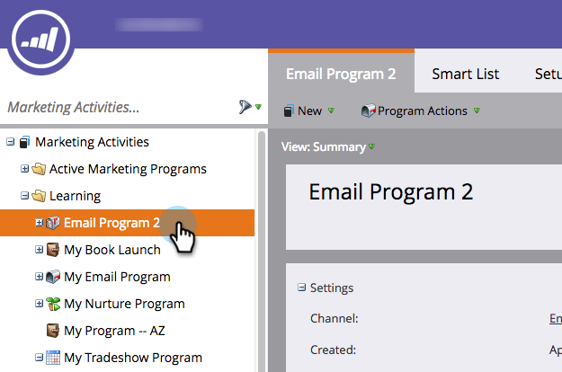

# プログラムでのレポートの作成 {#create-a-report-in-a-program}

人、プログラム、ランディングページ、電子メールおよびソーシャルアセットを分析するためのレポートを実行します。

1. 「 **マーケティングアクティビティ**」に移動します。
1. 

1. プログラムを選択します。

   

   >[!NOTE]
   >
   >「 **Analytics** 」タブからレポートを作成することもできます。

   プログラムを右クリックし、「New Local Asset」を選択します。

   

1. 「 **レポート**」をクリックします。

   

1. レポートの **タイプを選択します**。

   

   >[!TIP]
   >
   >それぞれ [`Report Type Overview`](http://docs.marketo.com/display/DOCS/Report+Type+Overview) の簡単な説明は、を参照してください。

   レポートに名前を付けます。

   

   >[!TIP]
   >
   >後でのレポートのナビゲーションをより簡単にするには、レポートタイプへの参照を名前に含めます。

   レポートの期間を設定します。 詳しくは、「レポート期間の [変更](../../../../product-docs/reporting/basic-reporting/editing-reports/change-a-report-time-frame.md) 」を参照してください。

1. 「 **レポート** 」タブをクリックして統計を表示します。

   

   >[!NOTE]
   >
   >**ディープダイブ**
   >
   >
   >デフォルトでは、レポートはプログラム全体のアカウント内のすべてのアクティビティを対象としています。 レポートをフィルタリングする様々な方法については、 [基本レポートの詳細](http://docs.marketo.com/display/docs/basic+reporting) を参照してください。

   >[!NOTE]
   >
   >**Reminder**
   >
   >
   >多数のレポートを簡単に作成できます。 不要になったレポートは [削除してください](../../../../product-docs/reporting/basic-reporting/report-activity/delete-a-report.md) 。

   >[!NOTE]
   >
   >**関連記事**
   >
   >
   >レポート期間の [変更、基本レポートの](../../../../product-docs/reporting/basic-reporting/editing-reports/change-a-report-time-frame.md)登録、Excelへのレポートの [書き出し](../../../../product-docs/reporting/basic-reporting/report-subscriptions/subscribe-to-a-basic-report.md)、スマートリストを使ったレポートの [フィルタ、スマート](../../../../product-docs/reporting/basic-reporting/report-activity/export-a-report-to-excel.md)を使ったレポートの人々のフィルタ、より多くのレポートの 変更を行えます。

