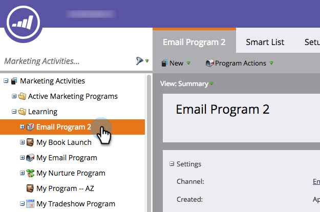

# プログラムでのレポートの作成 {#create-a-report-in-a-program}

レポートを実行して、リード、プログラム、ランディングページ、メール、ソーシャルアセットを分析します。

1. **[!UICONTROL マーケティングアクティビティ]**&#x200B;に移動します。

   

1. プログラムを選択します。

   

   >[!NOTE]
   >
   >「**[!UICONTROL 分析]**」タブからレポートを作成することもできます。

1. プログラムを右クリックし、「**[!UICONTROL 新規ローカルアセット]**」を選択します。

   

1. 「**[!UICONTROL レポート]**」をクリックします。

   

1. レポート&#x200B;**[!UICONTROL タイプ]**&#x200B;を選択します。

   

   >[!TIP]
   >
   >詳しくは、それぞれの短い説明の[レポートタイプの概要](https://docs.marketo.com/display/DOCS/Report+Type+Overview)を確認してください。

1. レポートに名前を付けます。

   

   >[!TIP]
   >
   >後でレポートを簡単に移動するには、名前にレポートタイプへの参照を含めます。

1. レポートの期間を設定します。 詳しくは、「[レポート期間の変更](/help/marketo/product-docs/reporting/basic-reporting/editing-reports/change-a-report-time-frame.md)」を参照してください。

1. 「**[!UICONTROL レポート]**」タブをクリックし、統計を確認します。

   

   >[!NOTE]
   >
   >デフォルトでは、レポートは、プログラムをまたいでアカウント内のすべてのアクティビティをカバーします。

   >[!NOTE]
   >
   >多くのレポートを素早く作成できます。 不要になったレポートは必ず[削除](/help/marketo/product-docs/reporting/basic-reporting/report-activity/delete-a-report.md)してください。

   >[!MORELIKETHIS]
   >
   >[レポート期間を変更する](/help/marketo/product-docs/reporting/basic-reporting/editing-reports/change-a-report-time-frame.md)、[基本レポートに購読する](/help/marketo/product-docs/reporting/basic-reporting/report-subscriptions/subscribe-to-a-basic-report.md)、[レポートを Excel に書き出す](/help/marketo/product-docs/reporting/basic-reporting/report-activity/export-a-report-to-excel.md)、[スマートリストを使用してレポート内のリードをフィルタリングする](/help/marketo/product-docs/reporting/basic-reporting/editing-reports/filter-people-in-a-report-with-a-smart-list.md)ことなどができます。
