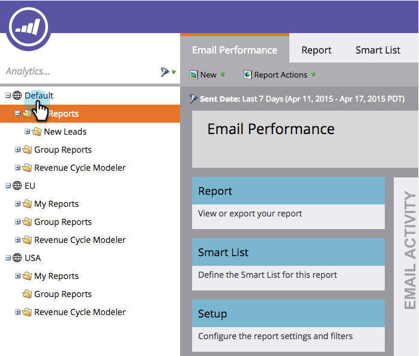

# 分析ホームページの操作 {#navigating-the-analytics-home-page}

1. **[!UICONTROL 分析]**&#x200B;領域に移動します。

   

1. [レポートタイプ](/help/marketo/product-docs/reporting/basic-reporting/report-types/report-type-overview.md)を選択します。

   

1. レポートを実行したら、ワークスペースをクリックして、**分析ホーム**&#x200B;に戻ります。

   

   これで完了です。 これで、分析ホームページを操作する方法がわかりました。

>[!MORELIKETHIS]
>
>[自分のレポートとグループのレポートについて](/help/marketo/product-docs/reporting/basic-reporting/creating-reports/understanding-my-reports-and-group-reports.md)
