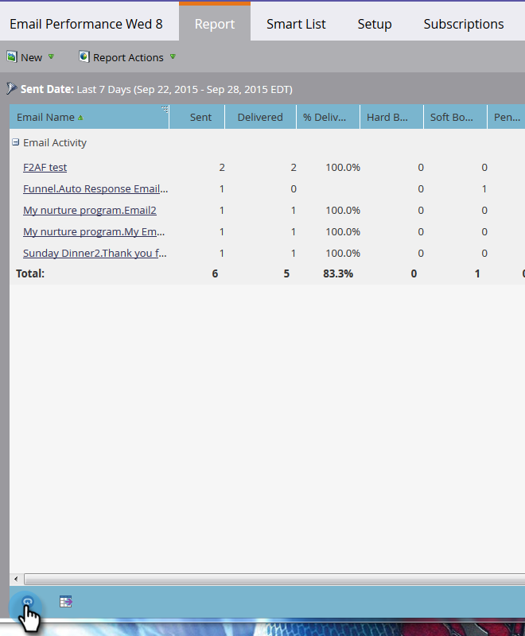
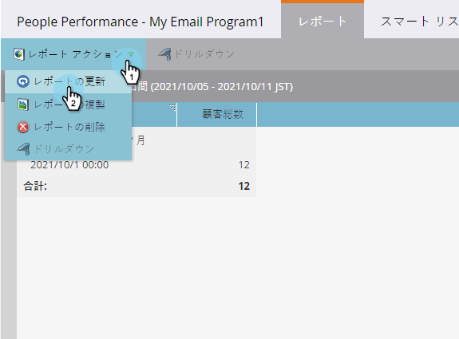

# レポートの更新{#refresh-a-report}

レポートを表示した後、Marketorはデータベースに保存するので、次回表示時にすばやく読み込まれます。 最初の表示後、レポートは24時間ごとに自動的に更新され、常に最新の状態になります。 ただし、いつでも手動で更新できます。

1. レポートが最後に更新された日時を確認するには、左下隅の丸い矢印アイコンにマウスポインターを置きます。

   

1. 円の矢印アイコンが更新ボタンです。 クリックするだけで最新の結果が得られます。

   

1. また、**レポートアクション**&#x200B;メニューをクリックし、**「レポートの更新**」を選択して、レポートを更新することもできます。

   

   ボイラ！

