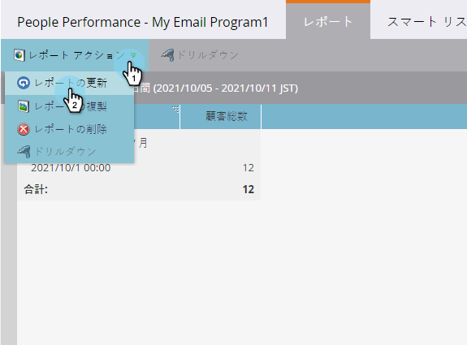

# レポートの更新 {#refresh-a-report}

表示されたレポートは、次回表示したときにすばやく読み込まれるようにデータベースに保存されます。 初回表示後、レポートは 24 時間ごとに自動的に更新され、常に最新の状態に保たれます。 ただし、いつでも手動で更新できます。

1. レポートが最後に更新された日時を確認するには、左下隅の円の矢印アイコンにマウスポインタを合わせます。

   

1. 円の矢印アイコンが更新ボタンです。 クリックするだけで最新の結果が得られます。

   

1. また、**[!UICONTROL レポートアクション]**&#x200B;メニューをクリックし、「**[!UICONTROL レポートを更新]**」を選択して更新することもできます。

   

   完了です。
