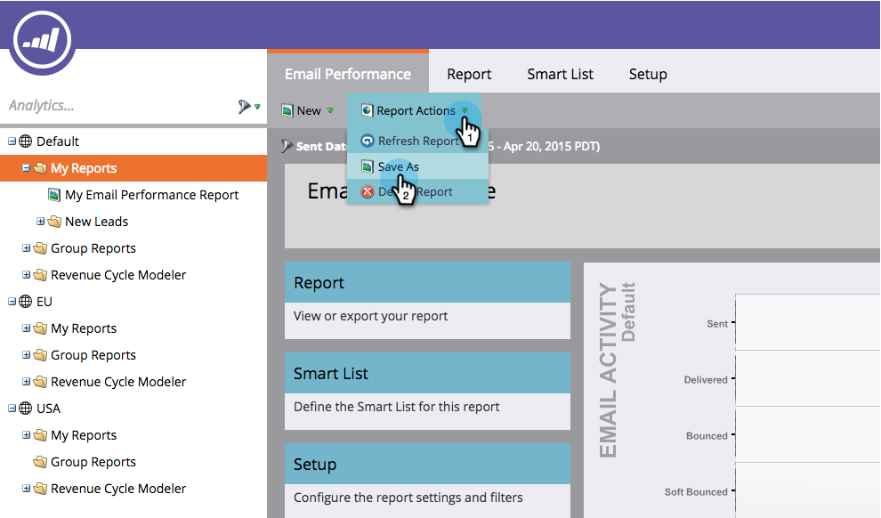

# レポートの保存 {#save-a-report}

場合によっては、後でデフォルトのレポートを表示に再び保存する必要が生じることがあります。 その方法を次に示します。

1. 「 **解析** 」領域に移動します。
1. 

1. レ [ポートタイプを選択します](../../../../product-docs/reporting/basic-reporting/report-types/report-type-overview.md)。

   

1. 「**レポートアクション**」をクリックし、「 **名前を付けて保存**」を選択します。

   

1. **「保存先** 」で場所を指定し、「 **フォルダー**」を選択します。

   

1. **レポートに名前を付け** 、「 **保存**」をクリックします。

   

   クール！ 保存したレポートがツリーに表示されます。

   

>[!NOTE]
>
>**関連記事**
>
>レポートをグループレポートに [コピーする方法を説明します](../../../../product-docs/reporting/basic-reporting/report-activity/clone-a-report-to-group-reports.md)。

