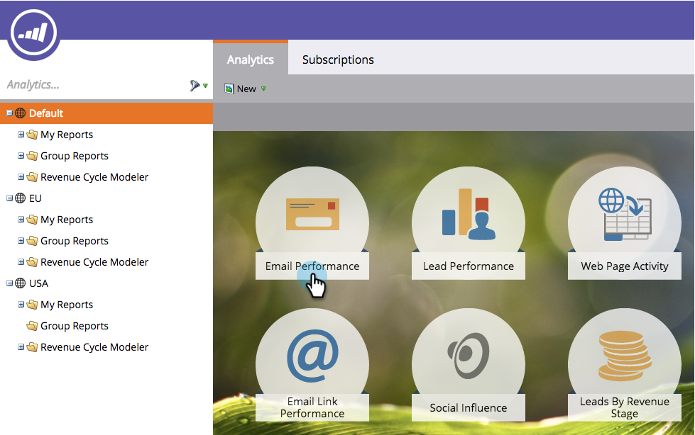

# レポートの保存 {#save-a-report}

デフォルトのレポートを後で再度表示するために保存する必要が生じることがあります。その方法は次のとおりです。

1. **分析**&#x200B;エリアに移動します。

   

1. [レポートタイプ](/help/marketo/product-docs/reporting/basic-reporting/report-types/report-type-overview.md)を選択します。

   

1. 「**レポートのアクション**」をクリックし、「**名前を付けて保存**」を選択します。

   

1. **保存先**&#x200B;の場所と&#x200B;**フォルダー**&#x200B;を選択します。

   

1. レポートに&#x200B;**名前**&#x200B;を付けて、「**保存**」をクリックします。

   

   これで完了です。保存したレポートがツリーに表示されます。

   

>[!MORELIKETHIS]
>
>[レポートをグループレポートにクローンする](/help/marketo/product-docs/reporting/basic-reporting/report-activity/clone-a-report-to-group-reports.md)方法を説明します。
