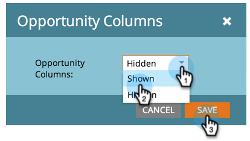
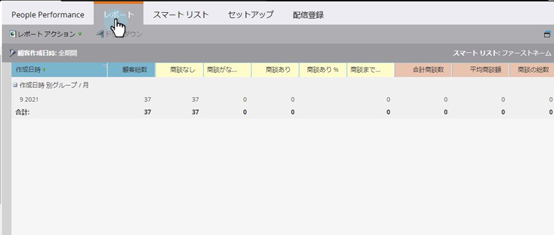

# リードレポートの追加オポチュニティ列{#add-opportunity-columns-to-a-lead-report}

[個人レポート](http://docs.marketo.com/display/docs/basic+reporting)のオポチュニティに関する統計を確認するには、オポチュニティ列を追加します。

1. **マーケティングアクティビティ**&#x200B;エリアに移動します。

   

1. ナビゲーションツリーからレポートを選択し、「**セットアップ**」タブをクリックします。

   

1. **「Opportunity Columns**」を重複・クリックします。

   

1. ドロップダウンメニューから「**表示**」を選択します。

   

1. 「**レポート**」タブをクリックすると、オポチュニティ指標を含むレポートが表示されます。

   

   >[!TIP]
   >
   >右にスクロールすると、列が表示されます。

1. [レポート](select-report-columns.md)に列を追加または削除するには、列見出しをクリックし、**列**&#x200B;を選択します。

   

   使用可能なオポチュニティの列は次のとおりです。

   >[!NOTE]
   >
   >各営業案件は、割り当てられた主担当者に基づいて1回だけカウントされます。

   | 列 | 説明 |
   |---|---|
   | オポチュニティなし | 主なオポチュニティの連絡先ではない&#x200B;*人の数です。* |
   | Days No Opportunity | 主要連絡先ではない&#x200B;*人の平均年齢（日単位）。* |
   | オポチュニティがある | 主なオポチュニティの連絡先である人の数です。 |
   | 営業案件%あり | 主なオポチュニティの連絡先である人の割合。 |
   | オポチュニティまでの日数 | 個人から主要オポチュニティの連絡先に変換する平均日数です。 |
   | Total Opportunity Amount | すべての営業案件金額の合計です。 |
   | 平均オポチュニティ金額 | 営業案件金額の合計を営業案件数で割った値です。 |
   | 商談合計 | すべてのオポチュニティの数。 |
   | 閉 | 閉じられた、勝った、または失われたオポチュニティの数。 |
   | ウォン | 獲得したオポチュニティの数。 |
   | 獲得率 | 獲得したオポチュニティの割合。 |
   | 合計勝者数 | 勝利した営業案件金額の合計です。 |
   | 閉じる日数 | オポチュニティを閉じる平均日数。 |
   | 販売日数 | 販売サイクルの平均長さ(「Days Until Opportunity + Days to Close」)。 |

   >[!NOTE]
   >
   >**関連記事**
   >
   >
   >[レポートのサイズを管理する方法](configure-report-size.md)を学びます。

   >[!NOTE]
   >
   >**ディープダイブ**
   >
   >
   >[基本レポート](http://docs.marketo.com/display/docs/basic+reporting)の深い潜水機で、レポートを使って他に何ができるかを見てください。

