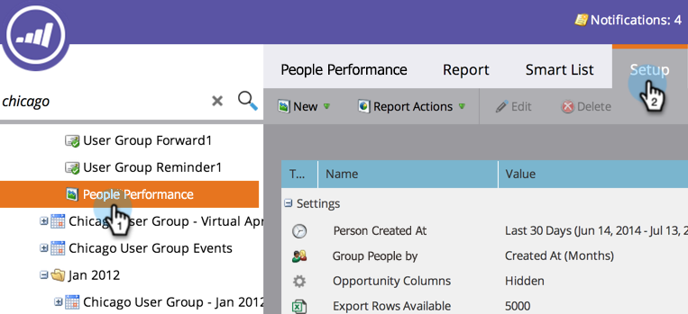

# リードレポートに商談列を追加する {#add-opportunity-columns-to-a-lead-report}

リードレポートで商談に関する統計を確認するには、商談列を追加します。

1. 「**マーケティング活動**」エリアに移動します。

   

1. ナビゲーションツリーから目的のレポートを選択し、「**セットアップ**」タブをクリックします。

   

1. 「**商談列**」をダブルクリックします。

   

1. ドロップダウンメニューから「**表示済み**」を選択します。

   

1. 「**レポート**」タブをクリックすると、レポートに商談指標が表示されています。

   

   >[!TIP]
   >
   >右にスクロールして、さらに列を表示します。

1. [レポートの列を追加または削除する](/help/marketo/product-docs/reporting/basic-reporting/editing-reports/select-report-columns.md)には、任意の列見出しをクリックして、「**列**」を選択します。

   

   使用可能な商談列は次のとおりです。

   >[!NOTE]
   >
   >各商談は、割り当てられた主要連絡先に基づいて 1 回だけカウントされます。

   | 列 | 説明 |
   |---|---|
   | 商談なし | 商談の主要連絡先で&#x200B;*ない*&#x200B;ユーザーの数。 |
   | 商談がなかった日数 | 商談の主要連絡先で&#x200B;*ない*&#x200B;ユーザーの平均年齢（日数）。 |
   | 商談あり | 主要商談連絡先であるリードの数。 |
   | 商談あり % | 主要商談連絡先であるリードの割合。 |
   | 商談までの日数 | リードからプライマリ主要商談連絡先へのコンバージョンにかかる平均日数。 |
   | 合計商談数 | すべての商談の総額。 |
   | 平均商談額 | 商談の総数で割った商談の総額。 |
   | 商談の総数 | すべての商談の数。 |
   | クローズ | クローズ、成立または損失した商談の数。 |
   | 獲得 | 成立した商談の数。 |
   | % 獲得 | 成立した商談の割合。 |
   | 獲得総額 | 成立した商談の総額。 |
   | クローズにかかる日数 | 商談クローズにかかる平均日数. |
   | 販売にかかる日数 | 販売サイクルの平均の長さ（商談までの日数+クローズにかかる日数）。 |

   >[!MORELIKETHIS]
   >
   >[レポートのサイズを管理する](/help/marketo/product-docs/reporting/basic-reporting/editing-reports/configure-report-size.md)方法を説明します。
