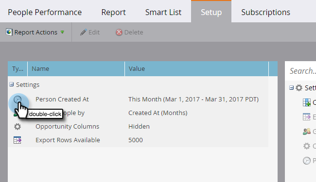
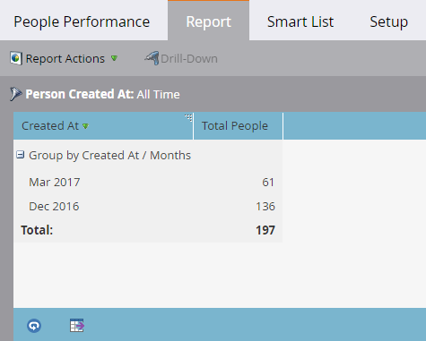

# レポートのタイムフレームを変更する {#change-a-report-time-frame}

特定のアクティビティ期間を重点的に見る場合は、レポートの対象になる期間を変更します。

1. **マーケティングアクティビティ**（または **Analytics** エリア）に移動します。

   

1. ナビゲーションツリーから目的のレポートを選択し、「**セットアップ**」タブをクリックします。

   

1. タイムフレームのフィールドをダブルクリックします。このフィールドのラベルは、レポートのタイプによって、次のように異なります。

   * **リード作成時期**（リードレポートの場合）
   * **送信日**（メールレポートの場合）
   * **アクティビティ日**（その他の各レポートの場合）

   

   >[!NOTE]
   >
   >**作成日**：データベース内でユーザーが認識された瞬間を指します。

1. ドロップダウンメニューから適切なタイムフレームを選択します。

   

   >[!TIP]
   >
   >特定の日付を設定するには、ドロップダウンメニューから「**カスタム**」を選択し、「**開始日**」および「**終了日**」のカレンダーフィールドに日付を入力します。

   「**レポート**」タブをクリックすると、選択したタイムフレームのレポートが表示されます。\
   

   >[!MORELIKETHIS]
   >
   >特定の個人属性でレポートを絞り込むには、[スマートリストを使用してレポート内の人をフィルター](/help/marketo/product-docs/reporting/basic-reporting/editing-reports/filter-people-in-a-report-with-a-smart-list.md)します。
