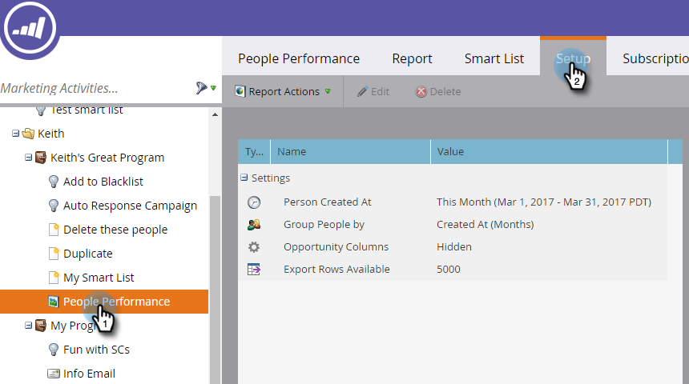
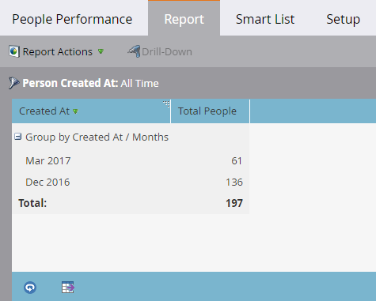

# レポートのタイムフレームを変更する {#change-a-report-time-frame}

特定のアクティビティ期間を重点的に見る場合は、レポートの対象になる期間を変更します。

1. **[!UICONTROL マーケティング活動]**（または **[!UICONTROL Analytics]** エリア）に移動します。

   

1. ナビゲーションツリーから目的のレポートを選択し、「**[!UICONTROL セットアップ]**」タブをクリックします。

   

1. タイムフレームのフィールドをダブルクリックします。このフィールドのラベルは、レポートのタイプによって、次のように異なります。

   * **[!UICONTROL リード作成時期]**（リードレポートの場合）
   * **[!UICONTROL 送信日]**（メールレポートの場合）
   * **[!UICONTROL アクティビティ日]**（その他の各レポートの場合）

   

   >[!NOTE]
   >
   >**[!UICONTROL 作成日]**：データベース内でユーザーが認識された瞬間を指します。

1. ドロップダウンメニューから適切なタイムフレームを選択します。

   

   >[!TIP]
   >
   >特定の日付を設定するには、ドロップダウンメニューから「**[!UICONTROL カスタム]**」を選択し、「**[!UICONTROL 開始日]**」および「**[!UICONTROL 終了日]**」のカレンダーフィールドに日付を入力します。

   「**[!UICONTROL レポート]**」タブをクリックすると、選択したタイムフレームのレポートが表示されます。
   

   >[!MORELIKETHIS]
   >
   >特定の個人属性でレポートを絞り込むには、[スマートリストを使用してレポート内の人をフィルター](/help/marketo/product-docs/reporting/basic-reporting/editing-reports/filter-people-in-a-report-with-a-smart-list.md)します。
