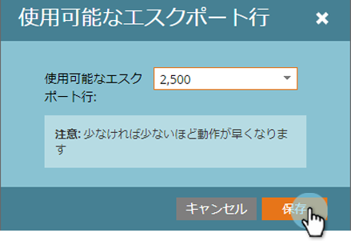

# レポートサイズの設定 {#configure-report-size}

マーケティングレポートのデフォルト行数は5,000行までですが、この制限は変更できます。

1. 「**マーケティングアクティビティ**」領域に移動します。

   

1. ナビゲーションツリーでレポートを選択し、「 **設定** 」タブをクリックします。

   

   重複を押しながら「 **使用可能な行のエクスポート**」をクリックします。

   

1. 新しい制限を選択します。

   

   >[!TIP]
   >
   >制限を変更すると、エクスポートしたExcelファイルだけでなく、レポートサイズ自体も変更されるので、レポートの生成に時間がかかりすぎる場合は、制限を減らしてください。

1. 「 **保存** 」をクリックして、新しい制限を確認します。

   

   終わった！ レポートには、新しい制限が適用されます。

   >[!NOTE]
   >
   >**関連記事**
   >
   >
   >これで、新しい制限でレポートを [エクスポートできます](../../../../product-docs/reporting/basic-reporting/report-activity/export-a-report-to-excel.md) 。

   レポートの設定方法について詳しくは、 [基本レポート](http://docs.marketo.com/display/docs/basic+reporting) （英語）を参照してください。

