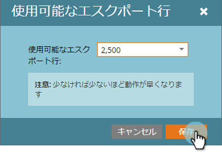

# レポートのサイズを設定する {#configure-report-size}

デフォルトでは、Marketo レポートの行数は 5,000 行までに制限されていますが、この制限は変更できます。

1. 「**[!UICONTROL マーケティング活動]**」エリアに移動します。

   

1. ナビゲーションツリーから目的のレポートを選択し、「**[!UICONTROL セットアップ]**」タブをクリックします。

   

1. 「**[!UICONTROL 使用可能なエスクポート行]**」をダブルクリックします。

   

1. 新しい日付を選択します。

   

   >[!TIP]
   >
   >制限を変更すると、書き出される [!DNL Excel] ファイルだけではなく、レポート自体のサイズが変わります。したがって、レポートの生成に時間がかかる場合は、制限を引き下げてください。

1. 「**[!UICONTROL 保存]**」をクリックして、新しい制限を確定します。

   

   完了です。レポートは新しい制限を守ります。

   >[!MORELIKETHIS]
   >
   >新しい制限で[レポート](/help/marketo/product-docs/reporting/basic-reporting/report-activity/export-a-report-to-excel.md)をエクスポートできます。
