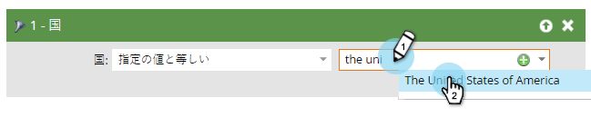

# スマートリストを使ってレポートでリードをフィルターする {#filter-people-in-a-report-with-a-smart-list}

スマートリストを使って、特定のリード属性を基準にレポートをフィルターします。

スマートリストは、以下のレポートタイプで使用できます。

* [担当者の実績](/help/marketo/product-docs/reporting/basic-reporting/report-types/people-performance-report.md)
* [ステータス別の担当者](/help/marketo/product-docs/reporting/basic-reporting/report-types/people-by-status-report.md)
* [メールの効果](/help/marketo/product-docs/email-marketing/email-programs/email-program-data/email-performance-report.md)
* [メールリンクの効果](/help/marketo/product-docs/email-marketing/email-programs/email-program-data/email-link-performance-report.md)
* [エンゲージメントストリームの効果](/help/marketo/product-docs/email-marketing/drip-nurturing/reports-and-notifications/engagement-stream-performance-report.md)
* [キャンペーンメール効果](/help/marketo/product-docs/reporting/basic-reporting/report-types/campaign-email-performance-report.md)
* [企業 Web アクティビティ](/help/marketo/product-docs/reporting/basic-reporting/report-types/company-web-activity-report.md)
* [Web ページアクティビティ](/help/marketo/product-docs/reporting/basic-reporting/report-types/web-page-activity-report.md)

1. 「**[!UICONTROL マーケティング活動]**」領域に移動します。

   

1. ナビゲーションツリーからレポートを選択し、「**[!UICONTROL スマートリスト]**」タブをクリックします。

   

1. 適切なフィルターを見つけ、ドラッグします。

   

1. フィルターを設定します。

   

1. 「**[!UICONTROL レポート]**」タブをクリックし、フィルターされたレポートを確認します。

   

   これで完了です。 これで、レポートには、スマートリストに一致するリードのデータのみが表示されます。
