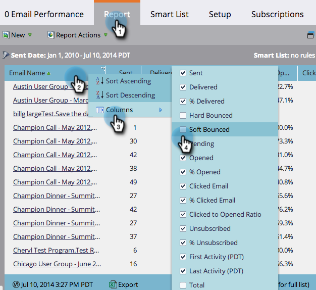

# レポート列の選択 {#select-report-columns}

レポートに含める列と含めない列を選択できます。

1. 「**Analytics **」(または「 **マーケティングアクティビティ**」)領域に移動します。

   

1. レポートを選択します。

   

1. 「 **レポート** 」タブをクリックし、列見出しをクリックして「 **列**」を選択し、含める列を選択します。

   

   >[!NOTE]
   >
   >**関連記事**
   >
   >    
   >    
   >    * [列でのレポートの並べ替え](sort-report-on-columns.md)

   レポートをさらに活用 「 [基本レポート](http://docs.marketo.com/display/docs/basic+reporting)」を参照してください。

