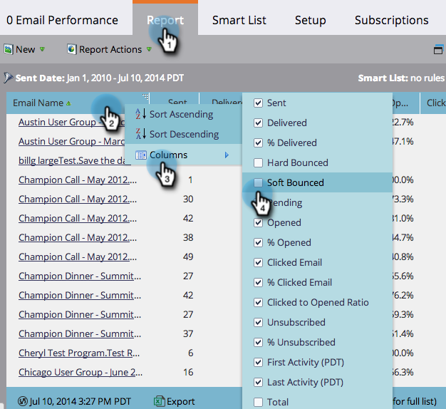

# レポート列の選択 {#select-report-columns}

レポートに含める列と含めない列を選択できます。

1. **[!UICONTROL 分析]**（または&#x200B;**[!UICONTROL マーケティング活動]**）領域に移動します。

   

1. レポートを選択します。

   

1. 「**[!UICONTROL レポート]**」タブをクリックし、任意の列見出しをクリックして、「**[!UICONTROL 列]**」を選択し、含める列を選択します。

   

   >[!MORELIKETHIS]
   >
   >[列でのレポートの並べ替え](/help/marketo/product-docs/reporting/basic-reporting/editing-reports/sort-report-on-columns.md)
