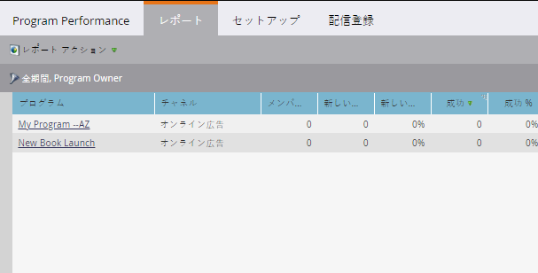

# 列でのレポートの並べ替え{#sort-report-on-columns}

列を使用してレポート内のデータを並べ替え、最も重要な数字を見つけやすくします。

1. **Analytics**(または&#x200B;**マーケティングアクティビティ**)に移動します。

   

1. ナビゲーションツリーからレポートを選択し、「**レポート**」タブをクリックします。

   

1. 最も重要な列をクリックし、並べ替え順を選択します。

   

1. 素晴らしい！ これで、レポート内の最も興味深いデータに焦点を当てることができます。

   

   >[!NOTE]
   >
   >**関連記事**
   >
   >    
   >    
   >    * [レポート列の選択](select-report-columns.md)

   >[!NOTE]
   >
   >**ディープダイブ**
   >
   >
   >[基本レポート](http://docs.marketo.com/display/docs/basic+reporting)で、レポートを操作する機能をすべて学びます。

