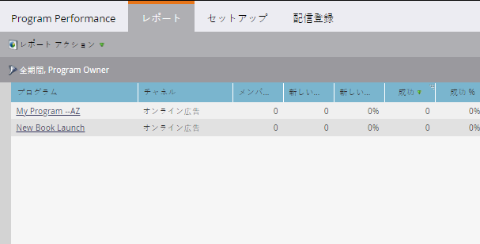

# 列でのレポートの並べ替え {#sort-report-on-columns}

列を使用してレポート内のデータを並べ替え、最も重要な数字を見つけやすくします。

1. **[!UICONTROL Analytics]**（または&#x200B;**[!UICONTROL マーケティングアクティビティ]**）エリアに移動します。

   

1. ナビゲーションツリーから目的のレポートを選択し、「**[!UICONTROL レポート]**」タブをクリックします。

   

1. 最も重要な列をクリックし、並べ替え順を選択します。

   

1. これで完了です。 これで、レポート内の最も興味深いデータに焦点を当てることができます。

   

   >[!MORELIKETHIS]
   >
   >[レポート列の選択](/help/marketo/product-docs/reporting/basic-reporting/editing-reports/select-report-columns.md)
