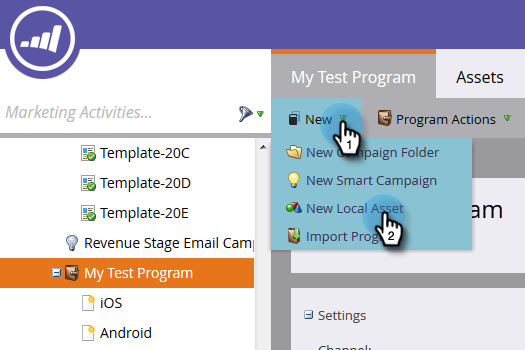
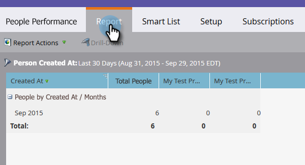

# モバイルプラットフォームの列があるリード効果レポートを作成する {#build-a-people-performance-report-with-mobile-platform-columns}

モバイルプラットフォーム（iOS/Android）の列があるリード効果レポートを作成するには、以下の手順を実行します。

## モバイルのスマートリストを作成する {#create-mobile-smart-lists}

1. **[!UICONTROL マーケティング活動]**&#x200B;に移動します。

   

1. プログラムを選択します。

   

1. 「**[!UICONTROL 新規作成]**」で「**[!UICONTROL 新規ローカルアセット]**」を選択します。

   

1. 「**[!UICONTROL スマートリスト]**」をクリックします。

   

1. 名前を入力し、「**[!UICONTROL 作成]**」をクリックします。

   

1. 「[!UICONTROL 開封済みメール]」フィルターを見つけて、キャンバスまでドラッグします。

   

1. 「メール」を「**[!UICONTROL いずれかに該当]**」に設定します。

   

1. 「**[!UICONTROL 制約の追加]**」をクリックして「**[!UICONTROL プラットフォーム]**」を選択します。

   

   >[!TIP]
   >
   >この例では、「[!UICONTROL 開封済みメール]」フィルターを使いました。「プラットフォーム」制約があるので、「[!UICONTROL クリック済みメール]」フィルターを使用することもできます。

1. 「[!UICONTROL プラットフォーム]」を「**[!UICONTROL iOS]**」に設定します。

   

   >[!NOTE]
   >
   >Marketo の自動提案で見つけられるには、少なくとも 1 つのリードが、iOS デバイス上でメールの 1 つを開封している必要があります。表示されていない場合は、手動で入力して保存してください。

   次に、Android プラットフォーム用に 2 番目のスマートリストを作成します。それが済んだら、次のセクションに進みます。

## リード効果レポートを作成する {#create-a-people-performance-report}

1. 「マーケティング活動」で、**[!UICONTROL iOS]** と **[!UICONTROL Android]** のスマートリストがあるプログラムを選択します。

   

1. 「**[!UICONTROL 新規作成]**」で「**[!UICONTROL 新規ローカルアセット]**」を選択します。

   

1. 「**[!UICONTROL レポート]**」をクリックします。

   

1. 「タイプ」を「**[!UICONTROL リード効果]**」に設定します。

   

1. 「**[!UICONTROL 作成]**」をクリックします。

   

   いいですね。次の節に進みます。

## モバイルのスマートリストを列として追加する {#add-mobile-smart-lists-as-columns}

1. 作成したレポートで、「**[!UICONTROL 設定]**」をクリックし、「**[!UICONTROL カスタム列]**」をキャンバスにドラッグします。

   

   >[!NOTE]
   >
   >デフォルトでは、リード効果レポートには過去 7 日間が表示されます。タイムフレームはダブルクリックすると変更できます。

1. 作成したスマートリストを探して選択し、「**[!UICONTROL 適用]**」をクリックします。

   

1. 「**[!UICONTROL レポート]**」をクリックしてレポートを実行し、データを確認します。

   

   素晴らしいですね。うまくいきました。
