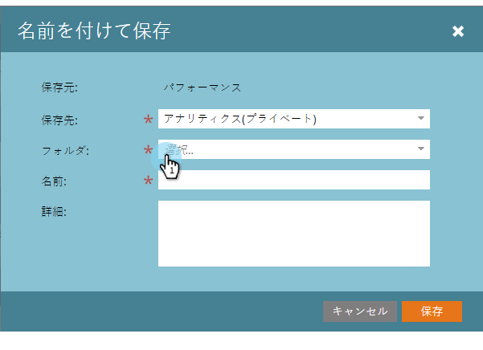
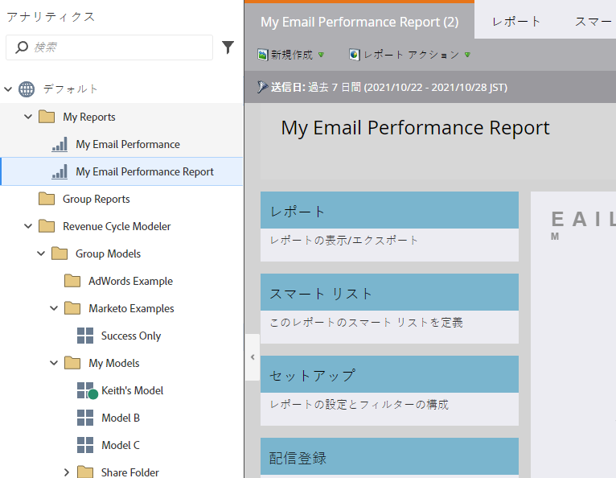

# レポートをグループレポートにコピーする {#clone-a-report-to-group-reports}

「**マイレポート**」内のレポートは、表示のみ可能です。 レポートを他のすべてのユーザーにアクセシビリティ対応にしたい場合はどうなりますか。 その方法を次に示します。

1. 「**Analytics **」領域で、目的の [保存済みレポートをクリックします](../../../../product-docs/reporting/basic-reporting/creating-reports/save-a-report.md)。
1. 

   >[!NOTE]
   >
   >または、保存したレポートをフォルダーにドラッグして「**グループレポート**」にコピーできます。

1. 「**レポートアクション**」をクリックし、「 **レポートのコピー**」を選択します。

   

1. **「** Analyticsにコピー **（グループ）** 」を選択し、 **フォルダーを選択します**。

   

1. **レポートに名前を付け** 、「 **複製**」をクリックします。

   

   クール！ レポートが **グループレポートに表示されます。**

   

