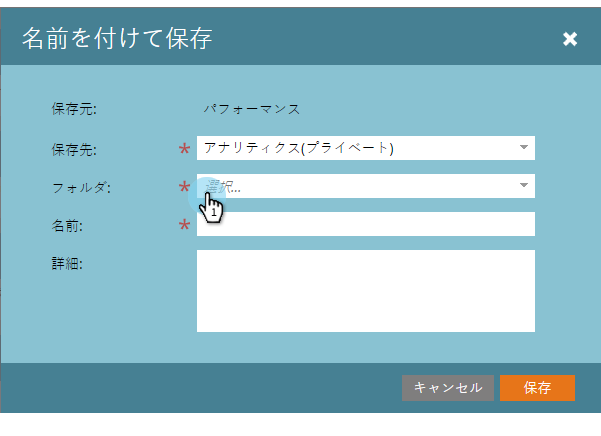
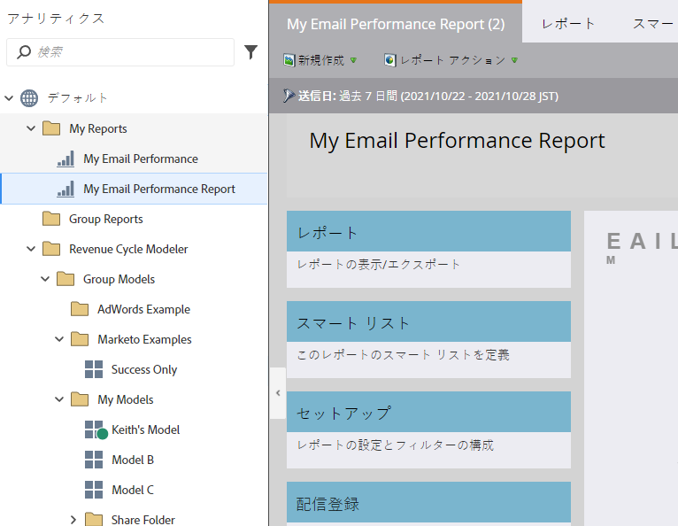

# レポートをグループレポートにクローンする {#clone-a-report-to-group-reports}

**[!UICONTROL マイレポート]**&#x200B;にあるレポートは、自分だけに表示されます。 他のすべてのレポートにアクセスできるようにするにはどうすればよいでしょうか。 その方法は次のとおりです。

1. **[!UICONTROL 分析]**&#x200B;領域で、目的の[保存済みレポート](/help/marketo/product-docs/reporting/basic-reporting/creating-reports/save-a-report.md)をクリックします。

   

   >[!NOTE]
   >
   >または、保存したレポートをフォルダーにドラッグして&#x200B;**[!UICONTROL グループレポート]**&#x200B;にクローンできます。

1. 「**[!UICONTROL レポートアクション]**」をクリックして、「**[!UICONTROL レポートをクローン]**」を選択します。

   

1. **[!UICONTROL クローン先]**&#x200B;ドロップダウンをクリックして、目的のグループを選択します。 「**[!UICONTROL フォルダー]**」を選択します。

   

1. レポートに&#x200B;**[!UICONTROL 名前]**&#x200B;を付けて、「**[!UICONTROL クローン]**」をクリックします。

   

   これで完了です。 レポートが&#x200B;**[!UICONTROL グループレポート]**&#x200B;に表示されます。

   
