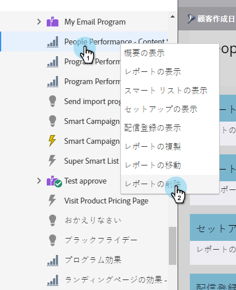

# レポートを削除する {#delete-a-report}

[レポートの作成](/help/marketo/product-docs/reporting/basic-reporting/creating-reports/create-a-report-in-a-program.md)を開始すると、すぐに多数のレポートが作成されます。不要になったレポートは必ず削除してください。

1. ツリー内の不要なレポートを右クリックし、「**レポートを削除**」を選択します。

   

1. 本当に削除していいかどうかを確定すると、レポートが削除されます。

   

   レポートはツリーから消えます。もう少し古いレポートを削除してください。
