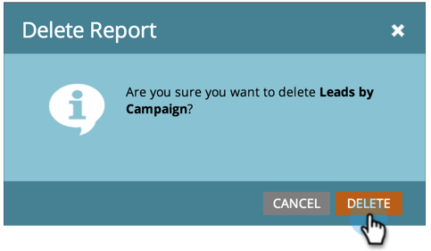

# レポートの削除 {#delete-a-report}

レポートの [作成開始が完了すると](../../../../product-docs/reporting/basic-reporting/creating-reports/create-a-report-in-a-program.md)、多数のレポートを簡単に作成できます。 不要になったレポートは忘れずに削除してください。

1. ツリー内の不要なレポートを右クリックし、「レポートの **削除**」を選択します。

   

1. レポートの削除の意図を確認します。

   

   レポートはツリーから消えます。 今すぐ、古いレポートを削除してください。

   >[!NOTE]
   >
   >**ディープダイブ**
   >
   >
   >レポートで可能なその他の機能については、 [基本レポートの詳細](http://docs.marketo.com/display/docs/basic+reporting) を参照してください。

