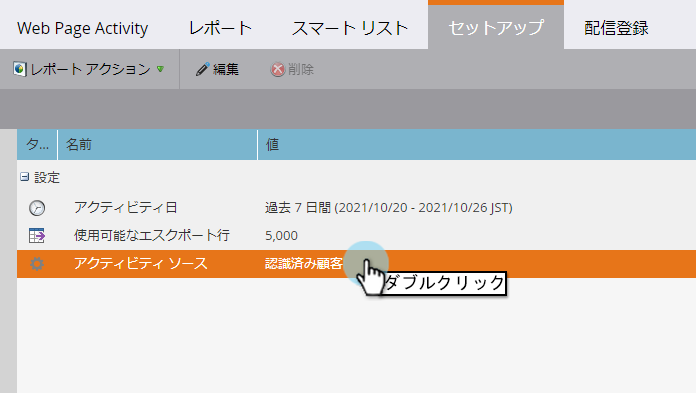

# Webレポートでの人または匿名訪問者の表示 {#display-people-or-anonymous-visitors-in-web-reports}

>[!NOTE]
>
>**前提条件**
>
>[Munchkin追加追跡コードをWebサイトに送信](../../../../product-docs/administration/additional-integrations/add-munchkin-tracking-code-to-your-website.md)

[ [ウェブページアクティビティ](../../../../product-docs/reporting/basic-reporting/report-types/web-page-activity-report.md) ]および[ [会社]の[ウェブアクティビティ]レポートでは](../../../../product-docs/reporting/basic-reporting/report-types/company-web-activity-report.md) 、サイトを訪問した [人または匿名訪問者](../../../../product-docs/core-marketo-concepts/smart-lists-and-static-lists/managing-people-in-smart-lists/understanding-anonymous-activity-and-people.md) を確認できます。 匿名訪問者は、Metro Areaなど、推定データを持っています。  レポートに既知のリードと匿名訪問者のどちらを表示するかを選択する方法を次に示します。

1. Webページアクティビティレポートで、「 **設定**」をクリックします。

   

1. 重複を押しながら **アクティビティソースをクリックします**。

   

1. ポップアップで、ドロップダウンから「**Known Leads **(people)」または** 「Anonymous」訪問者「**」を選択します。

   

   >[!NOTE]
   >
   >匿名訪問者用のISPを含めると、より長いレポートが生成されますが、これらを除外すると、Googleなどの標準的なソース以外に、訪問者がどこから来ているかを明確に表示できます。

1. それだ。 「 **レポート** 」タブをクリックして戻り、既知の人または匿名の人とレポートを表示します。

   

>[!NOTE]
>
>**関連記事**
>
>* [匿名アクティビティと人物の追跡](tracking-anonymous-activity-and-people.md)

>

