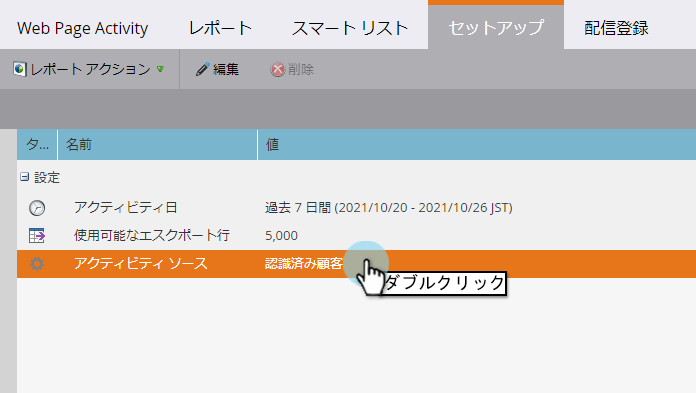

# Web レポートでのリードまたは匿名の訪問者の表示 {#display-people-or-anonymous-visitors-in-web-reports}

>[!PREREQUISITES]
>
>[Web サイトへの Munchkin トラッキングコードの追加](/help/marketo/product-docs/administration/additional-integrations/add-munchkin-tracking-code-to-your-website.md)

[[!UICONTROL Web ページアクティビティ]](/help/marketo/product-docs/reporting/basic-reporting/report-types/web-page-activity-report.md)レポートおよび[[!UICONTROL 企業の web アクティビティ]レポート](/help/marketo/product-docs/reporting/basic-reporting/report-types/company-web-activity-report.md)で、サイトを訪問した[人物または匿名の訪問者](/help/marketo/product-docs/core-marketo-concepts/smart-lists-and-static-lists/managing-people-in-smart-lists/understanding-anonymous-activity-and-people.md)が表示されます。 匿名の訪問者には、メトロエリアなどの推測されるデータがあります。  次に、レポートに既知のリードと匿名訪問者のどちらを表示するかを選択する方法を示します。

1. [!UICONTROL Web ページアクティビティ]レポートで、「**[!UICONTROL 設定]**」をクリックします。

   

1. 「**[!UICONTROL アクティビティソース]**」をダブルクリックします。

   

1. ポップアップで、「**[!UICONTROL 既知のリード]**」（ユーザー）または「**匿名訪問者**」をクリックします。

   

   >[!NOTE]
   >
   >匿名訪問者に ISP を含めると、レポートは長くなりますが、それらを除外すると、Google などの標準ソースに加えて、訪問者がどこから来たかをより明確に把握できます。

1. 「**[!UICONTROL レポート]**」タブをクリックして戻り、既知のリードまたは匿名訪問者のレポートの表示を確認します。

   

>[!MORELIKETHIS]
>
>[匿名アクティビティとリードのトラッキング](/help/marketo/product-docs/reporting/basic-reporting/report-activity/tracking-anonymous-activity-and-people.md)
