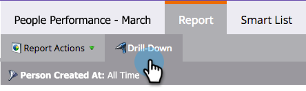

# 人物パフォーマンスレポートのドリルダウン{#drill-down-in-a-people-performance-report}

「人物パフォーマンス」レポートをドリル・ダウンして、追加の個人情報を表示します。

1. 「**レポート**」タブをクリックして、既存のレポートを表示します。

   

1. 詳細を表示するレポート行を選択します。

   

1. **Drill-Down**&#x200B;をクリックします。

   

1. **ドリルダウン**&#x200B;ポップアップで、ドリルダウンする属性を選択します。 「**ドリルダウン**」をクリックします。

   

1. 素晴らしい仕事！ ドリルダウン・レポートが新しいタブで開きます。 これで、新しいレポートを調べることができます。

   >[!TIP]
   >
   >新しいレポートタブが開いていない場合は、ブラウザーがポップアップをブロックしている可能性があります。 許可するブラウザー設定を変更します。

   

1. 結果を保存するには（オプション）、左下の&#x200B;**エクスポート**&#x200B;アイコンをクリックします。

   

