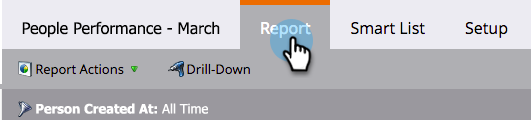

# リード効果レポートのドリルダウン {#drill-down-in-a-people-performance-report}

リード効果レポートのドリルダウンで、追加のリード情報を確認します。

1. 「**[!UICONTROL レポート]**」タブをクリックし、既存レポートを確認します。

   

1. 詳細を表示するレポートの行を選択します。

   

1. 「**[!UICONTROL ドリルダウン]**」をクリックします。

   

1. **[!UICONTROL ドリルダウン]**&#x200B;ポップアップで、ドリルダウンする属性を選択します。次に、「**[!UICONTROL ドリルダウン]**」をクリックします。

   

1. 完成です。ドリルダウンレポートが新しいタブで開きます。これで、新しいレポートを参照できます。

   >[!TIP]
   >
   >新しいレポートタブが開かない場合は、ブラウザーがポップアップをブロックしている可能性があります。ブラウザー設定を変更して許可してください。

   

1. 結果を保存するには（オプション）、左下の&#x200B;**[!UICONTROL 書き出し]**&#x200B;アイコンをクリックします。

   
