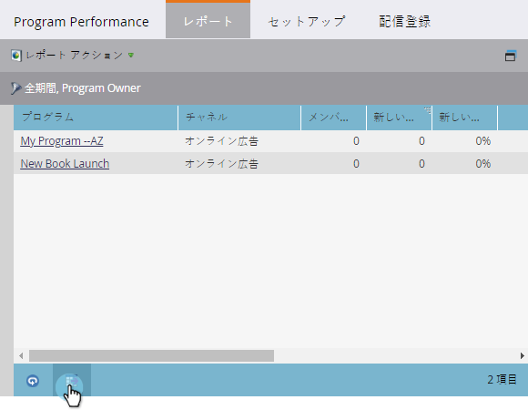

# レポートをExcelにエクスポートする{#export-a-report-to-excel}

任意のレポートをExcelファイルにエクスポートして、他のソフトウェアでデータを操作できます。

1. **マーケティングアクティビティ**&#x200B;エリアに移動します。

   

1. ナビゲーションツリーからレポートを選択し、「**レポート**」タブをクリックします。

   

1. 「**書き出し**」ボタンをクリックします。

   

   それだけだ！ Excelファイルをシステムに保存するように求めるプロンプトがブラウザに表示されます。

   >[!NOTE]
   >
   >**関連記事**
   >
   >
   >ダウンロードしたファイルが大きすぎる場合は、[レポートサイズ](../../../../product-docs/reporting/basic-reporting/editing-reports/configure-report-size.md)を変更できます。

   >[!NOTE]
   >
   >**ディープダイブ**
   >
   >
   >[基本的なレポート](http://docs.marketo.com/display/docs/basic+reporting)の詳細を参照して、レポートでできるその他の役に立つことをすべて確認してください。

