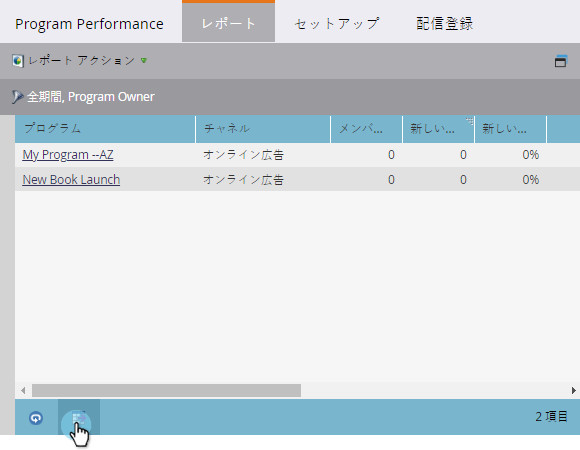

# レポートの [!DNL Excel] への書き出し {#export-a-report-to-excel}

任意のレポートを [!DNL Excel] ファイルに書き出して、他のソフトウェアでデータを処理できます。

1. **[!UICONTROL マーケティング活動]**&#x200B;領域に移動します。

   

1. ナビゲーションツリーから目的のレポートを選択し「**[!UICONTROL レポート]**」タブをクリックします。

   

1. 「**[!UICONTROL エクスポート]**」ボタンをクリックします。

   

   それだけです。[!DNL Excel] ファイルをシステムに保存するように求めるプロンプトがブラウザーに表示されます。

   >[!MORELIKETHIS]
   >
   >ダウンロードしたファイルが大きすぎる場合は、[レポートのサイズを変更](/help/marketo/product-docs/reporting/basic-reporting/editing-reports/configure-report-size.md)します。
