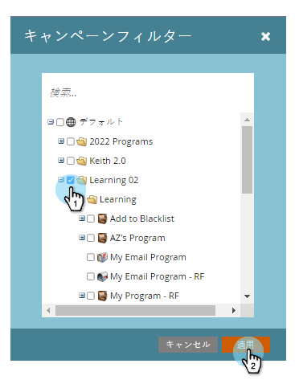

# キャンペーンアクティビティレポートをフィルターする {#filter-a-campaign-activity-report}

特定の[スマートキャンペーン](/help/marketo/product-docs/core-marketo-concepts/smart-campaigns/creating-a-smart-campaign/understanding-batch-and-trigger-smart-campaigns.md)を基準にして、[キャンペーンアクティビティレポート](/help/marketo/product-docs/reporting/basic-reporting/report-types/campaign-activity-report.md)を絞り込みます。

1. **マーケティングアクティビティ**（または&#x200B;**アナリティクス**）エリアに移動し、キャンペーンアクティビティレポートを選択します。

   

1. 「**セットアップ**」タブをクリックし、「**キャンペーン**」をダブルクリックします。

   

1. レポートに含めるフォルダーと特定のスマートキャンペーンを選択します。「**適用**」をクリックします。

   

   >[!TIP]
   >
   >フォルダーを選択すると、レポートの実行時にフォルダーに含まれるすべての項目がレポートに含まれます。

1. 完了です。「**レポート**」タブをクリックして、レポートで選択したスマートキャンペーン&#x200B;_のみ_&#x200B;を表示します。

   

>[!MORELIKETHIS]
>
>[メールの効果レポート](/help/marketo/product-docs/reporting/basic-reporting/report-types/campaign-email-performance-report.md)
