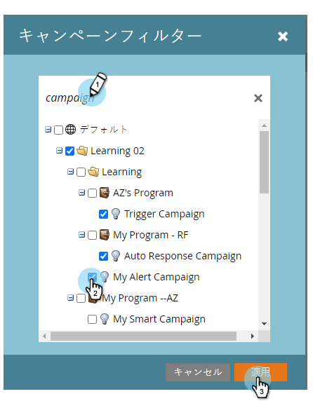

# キャンペーンの電子メールレポートでのアセットのフィルタリング {#filter-assets-in-a-campaign-email-reports}

プログラム内の特定のスマートキャンペーン [（「ローカルアセット」）またはアーカイブされたスマートキャンペーン](../../../../product-docs/reporting/basic-reporting/report-types/campaign-email-performance-report.md) に対して、「 [の電子メールパフォーマンス](http://docs.marketo.com/display/docs/smart+campaigns) 」レポートを絞り込みます。

1. 「**Analytics **」(または「 **マーケティングアクティビティ**」)領域に移動します。

   

1. 電子メールのパフォーマンスレポートを選択します。

   

1. 「 **設定** 」タブをクリックし、フィルターの上にドラッグします。

   

   * **キャンペーン**:Marketorアカウント内のアクティブなスマートキャンペーン。
   * **アーカイブされたキャンペーン**:非アクティブでリタイアされたスマートキャンペーン。

1. レポートに含めるフォルダーと特定のスマートキャンペーンを選択します。

   

   >[!TIP]
   >
   >フォルダーを選択した場合、レポートの実行時に、フォルダーに含まれるすべてのフォルダーがレポートに含まれます。

1. 終わった！ フィルターを適用したレポートを表示するには、 **「レポート** 」タブをクリックします。

   

   >[!NOTE]
   >
   >**関連記事**
   >
   >    
   >    
   >    * [キャンペーン電子メールのパフォーマンスレポート](../../../../product-docs/reporting/basic-reporting/report-types/campaign-email-performance-report.md)
   >    * [電子メールレポートでのアセットのフィルタリング](filter-assets-in-an-email-report.md)

   >[!NOTE]
   >
   >**ディープダイブ**
   >
   >
   >レポートに関するすべての情報は、 [基本レポートで説明します](http://docs.marketo.com/display/docs/basic+reporting)。

