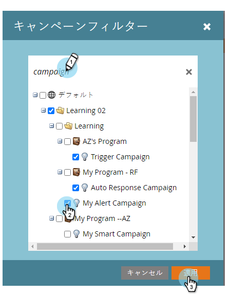

# キャンペーンメールレポートでのアセットのフィルター {#filter-assets-in-a-campaign-email-reports}

[キャンペーンメール効果](/help/marketo/product-docs/reporting/basic-reporting/report-types/campaign-email-performance-report.md)レポートの焦点をプログラム（「ローカルアセット」）またはアーカイブされた特定の[スマートキャンペーン](/help/marketo/product-docs/core-marketo-concepts/smart-campaigns/creating-a-smart-campaign/understanding-batch-and-trigger-smart-campaigns.md)に合わせます。

>[!NOTE]
>
>レポートのアセットのフィルタリングは、サテライトモード（アセットの詳細ページの右側にある「新しいウィンドウで開く」アイコン）ではサポートされていません。

1. **分析**（または&#x200B;**マーケティング活動**）領域に移動します。

   

1. 目的のメール効果レポートを選択します。

   

1. 「**[!UICONTROL セットアップ]**」タブをクリックして、フィルターをドラッグします。

   

   * **[!UICONTROL キャンペーン]**：Marketo アカウント内のアクティブなスマートキャンペーン。
   * **[!UICONTROL アーカイブキャンペーン]**：非アクティブで使わなくなったスマートキャンペーン。

1. レポートに含めるフォルダーと特定のスマートキャンペーンを選択します。

   

   >[!TIP]
   >
   >フォルダーを選択すると、レポートの実行時にフォルダーに含まれるすべての項目がレポートに含まれます。

1. 完了です！ 「**[!UICONTROL レポート]**」タブをクリックし、フィルターされたレポートを確認します。

   

   >[!MORELIKETHIS]
   >
   >[&#x200B; キャンペーンメールパフォーマンスレポート](/help/marketo/product-docs/reporting/basic-reporting/report-types/campaign-email-performance-report.md)
   >[メールレポートでのアセットのフィルター](/help/marketo/product-docs/reporting/basic-reporting/report-activity/filter-assets-in-an-email-report.md)
