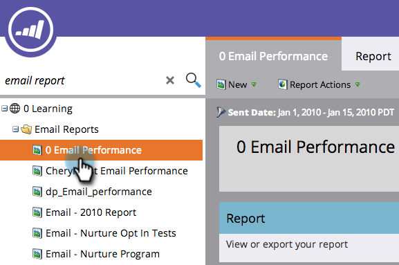

# メールレポートでのアセットのフィルター {#filter-assets-in-an-email-report}

プログラム（ローカルアセット）のメール、Design Studio のメール（グローバルアセット）、またはアーカイブされたメールに[メールの効果レポート](/help/marketo/product-docs/email-marketing/email-programs/email-program-data/email-performance-report.md)または[メールリンクの効果レポート](/help/marketo/product-docs/email-marketing/email-programs/email-program-data/email-link-performance-report.md)の焦点を合わせます。

>[!NOTE]
>
>レポートのアセットのフィルタリングは、サテライトモード（アセットの詳細ページの右側にある「新しいウィンドウで開く」アイコン）ではサポートされていません。

1. **分析**（または&#x200B;**マーケティング活動**）領域に移動します。

   

1. 目的のメールレポートを選択します。

   

1. 「**[!UICONTROL セットアップ]**」タブをクリックして、フィルターをドラッグします。

   

   * **[!UICONTROL Design Studio のメール]**：Design Studio で管理されているグローバルアセット。
   * **[!UICONTROL マーケティング活動のメール]**：「マーケティング活動」タブのプログラム内のローカルアセット。
   * **アーカイブメール**：非アクティブな古いメール。

1. レポートに含めるフォルダーと特定のメールを選択します。

   

   >[!TIP]
   >
   >フォルダーを選択すると、レポートの実行時にフォルダーに含まれるすべての項目がレポートに含まれます。

1. 完了です！ 「**[!UICONTROL レポート]**」タブをクリックし、フィルターされたレポートを確認します。

   

>[!MORELIKETHIS]
>
>[キャンペーンメールレポートでのアセットのフィルター](/help/marketo/product-docs/reporting/basic-reporting/report-activity/filter-assets-in-a-campaign-email-reports.md)
