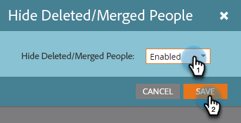

# メールパフォーマンスレポートの削除／結合されたレコードのフィルタリング {#filter-deleted-merged-records-in-an-email-performance-report}

メールパフォーマンスレポートは、プログラム内のメール（「ローカルアセット」）、Design Studio 内のメール（「グローバルアセット」）、またはアーカイブされたメールに焦点を当てます。

>[!NOTE]
>
>レポートのアセットのフィルタリングは、サテライトモード（アセットの詳細ページの右側にある「新しいウィンドウで開く」アイコン）ではサポートされていません。

1. **Analytics** （またはマーケティングアクティビティ）エリアに移動します。

   

1. メールのパフォーマンスレポートを選択します。

   

1. **設定** タブをクリックし、**削除/統合された人物を非表示** を選択します。

   

1. ドロップダウンをクリックし、「**有効**」を選択して「**保存**」をクリックします。

   

完了です。「レポート」タブをクリックして、フィルターされたレポートを表示します。
