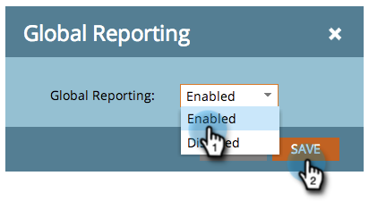

# ワークスペースをまたいだレポートメール、キャンペーンの効果 {#report-email-campaign-performance-across-workspaces}

グローバルレポートをオンにして、[メールパフォーマンス](/help/marketo/product-docs/email-marketing/email-programs/email-program-data/email-performance-report.md)および[メールリンクパフォーマンス](/help/marketo/product-docs/email-marketing/email-programs/email-program-data/email-link-performance-report.md)レポートに、すべての Marketo [ワークスペース](/help/marketo/product-docs/administration/workspaces-and-person-partitions/create-a-new-workspace.md)のデータを含めます。

1. **[!UICONTROL 分析]**（または&#x200B;**[!UICONTROL マーケティング活動]**）領域に移動します。

   

1. レポートを選択します。

   

1. 「**[!UICONTROL セットアップ]**」タブをクリックし、「**[!UICONTROL グローバルレポート]**」をダブルクリックします。

   

1. 「**[!UICONTROL 有効]**」を選択します。

   

1. それだけです。「**[!UICONTROL レポート]**」タブをクリックすると、すべてのワークスペースのデータが表示されます。

   

   >[!MORELIKETHIS]
   >
   >[メールレポートでのアセットのフィルター](/help/marketo/product-docs/reporting/basic-reporting/report-activity/filter-assets-in-an-email-report.md)
