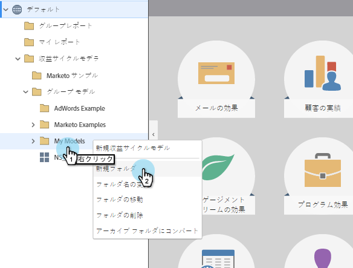

# ワークスペース間でのモデルの共有 {#share-a-model-across-workspaces}

Marketorでは、複数のワークスペースでモデルを共有できます。 これが方法です。

1. 「 **解析** 」セクションに移動します。

   

1. 「 **My Models** 」フォルダを右クリックし、「 **New Folder**」をクリックします。

   

1. フォルダーに名前を付けます。

   

1. 共有するモデルを **共有フォルダにドラッグします**。

   

1. フォルダーを右クリックし、「 **Share Folder**」をクリックします。

   

   >[!NOTE]
   >
   >
   >モデルを別のワークスペースと共有すると、モデルに基づいてレポートを実行できます。

1. フォルダーを共有するワークスペースを選択し、「 **保存**」をクリックします。

   

簡単だ！ これで、他のワークスペースのユーザーは共有モデル内を移動できます。 そのワークスペースで個人アサイメントを実行する場合は、詳細は「収益サイクル・モデルの [起動](https://community.marketo.com/MarketoArticle?id=kA050000000KyvQCAS) 」を参照してください。
