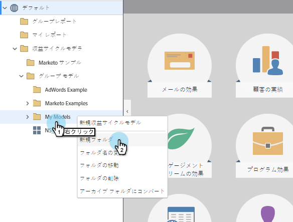

# ワークスペースをまたいだモデルの共有 {#share-a-model-across-workspaces}

Marketo を使用すると、ワークスペースをまたいでモデルを共有できます。 手順は以下のとおりです。

1. **[!UICONTROL 分析]**&#x200B;セクションに移動します。

   

1. 「**[!UICONTROL 自分のモデル]**」フォルダーを開き、「**[!UICONTROL 新規フォルダー]**」をクリックします。

   

1. フォルダーの名前を指定します。

   

1. 共有するモデルを「**[!UICONTROL 共有フォルダー]**」にドラッグします。

   

1. フォルダーを右クリックし、「**[!UICONTROL 共有フォルダー]**」をクリックします。

   

   >[!NOTE]
   >
   >モデルを別のワークスペースと共有すると、そのモデルに基づいてレポートを実行できます。

1. フォルダーを共有するワークスペースを選択し、「**[!UICONTROL 保存]**」をクリックします。

   

本当に簡単です！ 他のワークスペースのユーザーが共有モデルを利用できるようになります。
