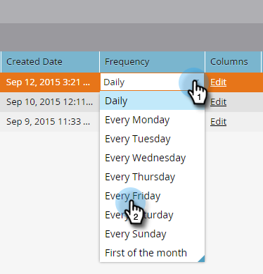
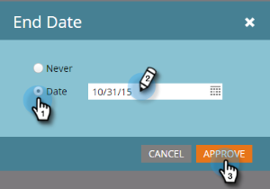

# スマートリスト購読の編集 {#edit-a-smart-list-subscription}

これらの列は、マーケティング活動またはデータベースに表示される「購読」タブで直接編集できます。

* [!UICONTROL 受信者]
* [!UICONTROL 頻度]
* [!UICONTROL 列]
* [!UICONTROL 配信終了]
* [!UICONTROL 形式]

1. **[!UICONTROL データベース]**&#x200B;を選択します（この例では使用していますが、マーケティング活動はまったく同じように機能します）。

   

1. 編集する購読を選択します。

   

1. 「**[!UICONTROL 受信者]**」列をクリックすると、その他のメールアドレスを入力できるように表示されます（コンマで区切ります）。

   

1. **[!UICONTROL 頻度]**&#x200B;列をクリックして、設定を選択または変更します。

   

1. 「**[!UICONTROL 列]**」列を開き、セレクターを使用してレポートの列を追加または削除します。 レポート列には使用可能なすべての列が含まれ、Marketo 列にはレポートに表示するように選択した列のみが表示されます。 「**[!UICONTROL 保存]**」をクリックします。

   

   >[!NOTE]
   >
   >「Marketo 列」の下にある列はレポート列で、「購読レポート」タブで使用される列ではありません。

1. **[!UICONTROL 終了日]**&#x200B;列をクリックして、終了日を編集します。 「**[!UICONTROL なし]**」または&#x200B;**[!UICONTROL 日付]**&#x200B;を選択します。 日付の場合は、入力するか、カレンダーから選択します。 「**[!UICONTROL 承認]**」をクリックします。

   

1. このパズルの最後のピースは形式です。 **[!UICONTROL 形式]**&#x200B;列をクリックして、目的の形式を選択します。 CSV がデフォルトです。

   
