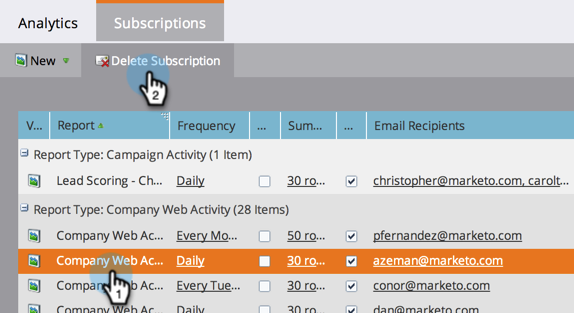

# レポート購読の管理 {#manage-report-subscriptions}

レポート購読を設定および削除します。

1. 「 **解析** 」領域に移動します。

   

1. 「 **購読** 」タブをクリックします。

   

   このページには、アカウント内のすべてのレポートに対する購読が表示され、 [レポートタイプ別にグループ化されています](../../../../product-docs/reporting/basic-reporting/report-types/report-type-overview.md)。 これには、基本レポート [、](subscribe-to-a-basic-report.md) 売上高サイクルエクスプローラ [(Revenue Cycle Explorer](http://docs.marketo.com/display/docs/revenue+cycle+analytics) )レポートへの購読が含まれます。

   >[!TIP]
   >
   >また、 **マーケティングアクティビティ内の個々のレポートに対する購読を管理することもできます**。 レポートを選択し、「 **購読** 」タブをクリックします。

   レポートの電子メール送信頻度を変更するには、[頻度]フィールドをクリックし、ドロップダウンメニューから新しいオプションを選択します。

   

1. 購読内の電子メールアドレスを変更するには、「 **電子メール受信者** 」フィールドをクリックし、電子メールアドレスを編集します。

   

   >[!TIP]
   >
   >
   >    
   >    
   >    * 電子メールアドレスはコンマで区切って指定します。
   >    * 編集内容を保存するには、購読リスト *の外側の領域をクリックし* ます。

   また、次のこともできます。

   * レポートを開くには、 **表示** ・ボタンをクリックします。
   * 購読を非アクティブにするには、「 **アクティブ** 」チェックボックスの選択を解除します。
   * 「 **サマリ** 」フィールドをクリックして編集し、電子メールに表示するプレビュー行数を変更します。
   * スプレッドシートの添付ファイルを使用せずにレポートの概要を送信する場合は、「 **Excel** 」チェックボックスの選択を解除します。
   * レポートの電子メールを直ちに送信するには、 **「送信** 」ボタンをクリックします。

1. 購読を完全に削除するには、行を選択し、「購読を **削除**」をクリックします。

   

1. 購読の削除の意図を確認します。

   

   >[!NOTE]
   >
   >**関連記事**
   >
   >    
   >    
   >    * [基本レポートの購読](subscribe-to-a-basic-report.md)
   >    * [売上高エクスプローラレポートの購読](../../../../product-docs/reporting/revenue-cycle-analytics/revenue-explorer/subscribe-to-a-revenue-explorer-report.md)

   詳しくは、 [基本レポート](http://docs.marketo.com/display/docs/basic+reporting) および [売上高サイクルの詳細](http://docs.marketo.com/display/docs/revenue+cycle+analytics) （英語）を参照してください。

