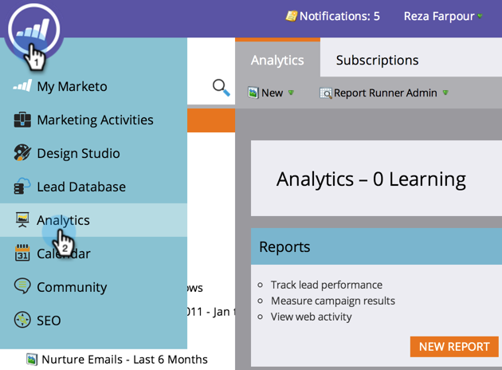
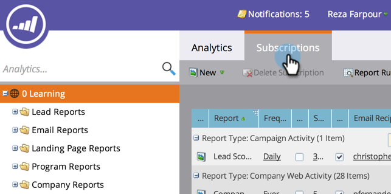
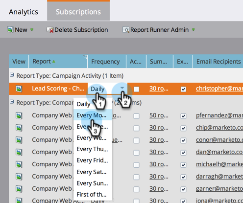

# レポート購読の管理 {#manage-report-subscriptions}

レポートの購読を設定および削除します。

1. **[!UICONTROL 分析]**&#x200B;領域に移動します。

   

1. 「**[!UICONTROL 購読]**」タブをクリックします。

   

   このページには、アカウント内のすべてのレポートの購読が[レポートタイプ](/help/marketo/product-docs/reporting/basic-reporting/report-types/report-type-overview.md)別に表示されます。 これには[基本レポートの購読](/help/marketo/product-docs/reporting/basic-reporting/report-subscriptions/subscribe-to-a-basic-report.md)と Revenue Cycle Explorer レポートの購読が含まれます。

   >[!TIP]
   >
   >また、個々のレポートの購読は&#x200B;**[!UICONTROL マーケティング活動]**&#x200B;でも管理できます。 レポートを選択して、「**[!UICONTROL 購読]**」タブをクリックします。

   レポートのメール送信頻度を変更するには、「頻度」フィールドをクリックして、ドロップダウンメニューから新しいオプションを選択します。

   

1. 購読のメールアドレスを変更するには、「**[!UICONTROL メール受信者]**」フィールドに入力し、メールアドレスを編集します。

   

   >[!TIP]
   >
   >* メールアドレス間にコンマを使用します。
   >* 編集内容を保存するには、購読リストの&#x200B;_外_&#x200B;の領域をクリックします。

   また、次のこともできます。

   * 「**[!UICONTROL 表示]**」ボタンをクリックして、レポートを開く。
   * 「**[!UICONTROL アクティブ]**」チェックボックスをオフにして、購読を無効にする。
   * 「**[!UICONTROL 概要]**」フィールドをクリックして編集し、メールに表示されるプレビュー行の数を変更する。
   * 「**[!UICONTROL Excel]**」チェックボックスをオフにして、スプレッドシートの添付ファイルなしでレポートの概要を送信する。
   * 「**[!UICONTROL 送信]**」ボタンをクリックして、レポートのメールを直ちに送信する。

1. 購読を完全に削除するには、行を選択して「**[!UICONTROL 購読を削除]**」をクリックする。

   

1. 本当に削除していいかどうかを確定すると、購読が削除されます。

   

   >[!MORELIKETHIS]
   >
   >[基本レポートの購読](/help/marketo/product-docs/reporting/basic-reporting/report-subscriptions/subscribe-to-a-basic-report.md)

