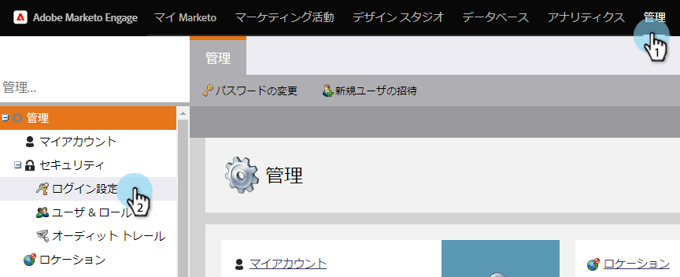

# 購読管理設定の保護 {#secure-the-subscription-admin-setting}

>[!NOTE]
>
>**管理者権限が必要**

管理者は、レポートを表示するためにログインを必要にすることを選択できます。

1. **管理者**／**ログイン設定**&#x200B;をクリックします。

   

1. スマートリストレポート設定の「**編集**」をクリックします。

   

1. レポートをダウンロードするのにログインを必要にするには、「**はい**」を選択します。

   

   >[!CAUTION]
   >
   >レポートのダウンロードにログインが必要な場合、Marketo へのアクセス権を持っていないと、スマートリストレポートメールを受信しません。これは、既存および将来のサブスクリプションに適用されます。
