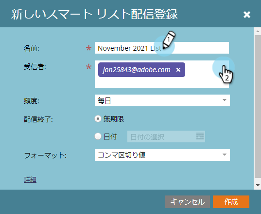

# スマートリストのサブスクリプションを購入 {#subscribe-to-a-smart-list}

スマートリストの購読は、レポートを受信トレイに直接送信し、人を追跡する優れた方法です。

>[!NOTE]
>
>**FYI**
>
>Marketoは現在、すべての購読で言語を標準化しているので、購読およびdocs.marketo.comの人物/人物にリード/リードを表示できます。 これらの用語は同じことを意味し、記事の説明には影響しません。 他にも変化がある。 [詳細情報](http://docs.marketo.com/display/DOCS/Updates+to+Marketo+Terminology)。

スマートリスト購読は、次の2つの場所に作成できます。

* マーケティングアクティビティ
* データベース

購読は、購読の実行時に完全なリストのユーザーを使用します。

購読は、スマートリストの居住地、マーケティングアクティビティまたはデータベースに住んでいます。

同じスマートリストから複数の購読を作成できます。

購読は、ワークスペースに固有です。 例えば、次の購読のリストは、この記事の残りの部分に表示されるワークスペースとは異なるワークスペースにあります。

>[!NOTE]
>
>1つの購読、複数の購読、複数のワークスペース、1つのMarketoインスタンスにつき、100人のワークスペースと最大100,000人のユーザーに制限されます。 スマートリストに100,000を超える名前が含まれる場合、Marketorは最初の100,000に対して購読を実行します。

## スマートリスト購読の作成 {#create-a-smart-list-subscription}

1. 「 **データベース」**&#x200B;または「マーケティングアクティビティ&#x200B;****」に移動します。

   

1. 購読を作成するスマートリストを選択します。 「 **リストアクション** 」をクリックし、「**新規スマートリスト購読**」を選択します。

   

1. 購読に **名前を入力し**、 **受信者の電子メールアドレスを選択または入力します**。

   

1. 「 **頻度** 」リストをクリックし、頻度を選択します。

   ** 

   **

1. **終了配信**日付を設定します。 「 **なし** 」または「カレンダーの日付」を選択できます。

   

1. 「 **形式** 」をクリックし、リストから選択します。

   

1. 「 **作成**」をクリックします。

   

1. 新しいスマートリスト購読が[購読]タブのリストの上部に表示されます。 今すぐ送信する場合は **「送信** 」をクリックします。スケジュールされた電子メール配信が完了するまで待ちません。

   

1. スマートリスト購読を登録していない場合は、「アクティブ」チェックボックスをオフにして、スマート登録を非アクティブにすることをお勧めします。

   

   それは簡単でしたね。

## 電子メールメッセージ {#email-message}

受信者は、レポートをダウンロードするオプションと、Marketorインスタンス内のリストに直接リンクするオプションを含む電子メールを受信します。 ダウンロードリンクは4日後に期限切れになります。

>[!NOTE]
>
>「 [セキュア購読管理者](secure-the-subscription-admin-setting.md) 」設定が「 **はい**」に設定されている場合は、Marketoインスタンスにアクセスできるユーザーのみがレポートをダウンロードできます。

レポートに0人のユーザーが含まれている場合、受信者は電子メールを受信します。 ただし、電子メールには、単にレポートする人がいないことを示しています。

>[!NOTE]
>
>購読に基づいたスマートリストフィルタを変更すると、レポートも更新されます。

この電子メールには、リストの作成に使用されたフィルターに関する追加情報も記載されています。

## 購読の削除 {#delete-a-subscription}

購読を削除するには、「購読」タブで購読を選択し、「削除」をクリックします。

>[!NOTE]
>
>**関連記事**
>
>* [スマートリスト購読の編集](edit-a-smart-list-subscription.md)
>* [購読管理者設定の保護](secure-the-subscription-admin-setting.md)

>

