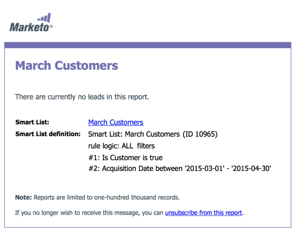

# スマートリストの登録{#subscribe-to-a-smart-list}

スマートリストの購読は、レポートを受信トレイに直接送信し、人を追跡する優れた方法です。

スマートリスト購読は、次の2つの場所に作成できます。

* マーケティング活動
* データベース

購読は、購読の実行時に完全なリストのユーザーを使用します。

購読は、スマートリストの居住地、マーケティングアクティビティまたはデータベースに住んでいます。

同じスマートリストから複数の購読を作成できます。

購読は、ワークスペースに固有です。 例えば、次の購読のリストは、この記事の残りの部分に表示されるワークスペースとは異なるワークスペースにあります。

>[!NOTE]
>
>100人の購読と100,000人のユーザーに制限されます1人の購読、1つのワークスペース、1つのMarketoインスタンスに対して最大100,000人です スマートリストに100,000を超える名前が含まれる場合、Marketoは最初の100,000に対して購読を実行します。

## スマートリスト購読の作成{#create-a-smart-list-subscription}

1. **データベース**&#x200B;または&#x200B;**マーケティングアクティビティ**&#x200B;に移動します。

   

1. 購読を作成するスマートリストを選択します。 「**リストアクション**」をクリックし、「**新しいスマートリスト購読**」を選択します。

   

1. 購読に&#x200B;**名前**&#x200B;を入力し、**受信者**&#x200B;の電子メールアドレスを選択または入力します。

   

1. 「**頻度**」リストをクリックし、頻度を選択します。

   

1. **終了配信**&#x200B;の日付を設定します。 **なし**&#x200B;またはカレンダーの日付を選択できます。

   

1. 「**フォーマット**」をクリックし、リストから選択します。

   

1. 「**作成**」をクリックします。

   

1. 新しいスマートリスト購読が[購読]タブのリストの上部に表示されます。 今すぐ送信する場合は「**送信**」をクリックし、スケジュールされた電子メール配信まで待たないでください。

   

1. スマートリスト購読を登録していない場合は、「アクティブ」チェックボックスをオフにして、スマート登録を非アクティブにすることをお勧めします。

   

   それは簡単でしたね。

## 電子メールメッセージ{#email-message}

受信者には、レポートをダウンロードするオプションと、Marketoインスタンス内のリストに直接リンクするオプションが記載された電子メールが届きます。 ダウンロードリンクは4日後に期限切れになります。

>[!NOTE]
>
>[セキュア購読管理者](/help/marketo/product-docs/reporting/basic-reporting/report-subscriptions/secure-the-subscription-admin-setting.md)の設定が&#x200B;**はい**&#x200B;に設定されている場合、Marketoインスタンスにアクセスできるユーザーのみがレポートをダウンロードできます。

レポートに0人のユーザーが含まれている場合、受信者は電子メールを受信します。 ただし、電子メールには、単にレポートする人がいないことを示しています。

>[!NOTE]
>
>購読に基づいたスマートリストフィルタを変更すると、レポートも更新されます。

この電子メールには、リストの作成に使用されたフィルターに関する追加情報も記載されています。

## 購読の削除{#delete-a-subscription}

購読を削除するには、「購読」タブで購読を選択し、「削除」をクリックします。

>[!MORELIKETHIS]
>
>* [スマートリスト購読の編集](/help/marketo/product-docs/reporting/basic-reporting/report-subscriptions/edit-a-smart-list-subscription.md)
>* [購読管理者設定の保護](/help/marketo/product-docs/reporting/basic-reporting/report-subscriptions/secure-the-subscription-admin-setting.md)

