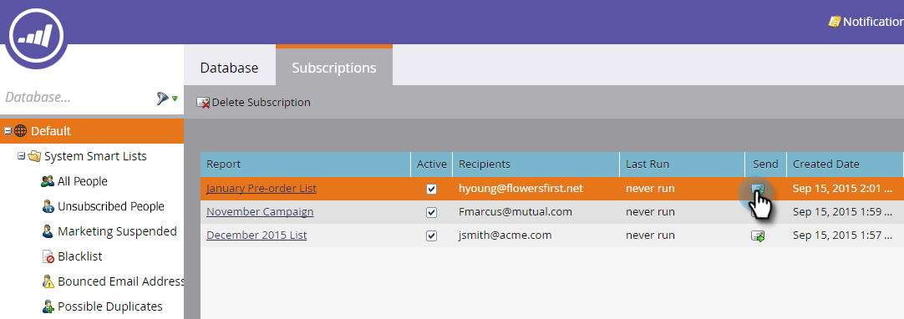

# スマートリストの購読 {#subscribe-to-a-smart-list}

スマートリストを購読すると、レポートがインボックスに送信されるので、リードを追跡するのに最適です。

スマートリストの購読は、2 つの異なる場所で作成できます。

* マーケティング活動
* データベース

購読の実行時には、すべてのリードのリストが使用されます。

購読は、スマートリストが存在する場所、マーケティング活動またはデータベースに存在します。

同じスマートリストから複数の購読を作成できます。

購読は、ワークスペース固有です。例えば、この購読のリストは、この記事の残りの部分に表示されるワークスペースとは異なるワークスペースにあります。

>[!NOTE]
>
>Marketo インスタンスごとに（すべてのワークスペースをまたいで）、購読 100 件とユーザー 100,000 人の上限があります。スマートリストに 100,000 件を超える名前が含まれている場合、最初の 100,000 件のみに対して購読が実行されます。

## スマートリスト購読の作成 {#create-a-smart-list-subscription}

1. **データベース**&#x200B;または&#x200B;**マーケティング活動**&#x200B;に移動します。

   

1. 購読を作成するスマートリストを選択します。「**リストアクション**」をクリックし、「**新規スマートリスト購読**」を選択します。

   

1. 購読に&#x200B;**名前**&#x200B;をつけて、**受信者**&#x200B;のメールアドレスを選択または入力します。

   

1. **頻度**&#x200B;リストをクリックして、頻度を選択します。

   

1. **配信終了**&#x200B;日付を設定します。「**なし**」またはカレンダーの日付を選択できます。

   

1. 「**形式**」をクリックしてリストから選択します。

   

1. 「**作成**」をクリックします。

   

1. 「購読」タブのリストの上部に、新しいスマートリスト購読が表示されます。スケジュールに沿ったメール配信を待たずに今すぐ送信する場合は、「**送信**」をクリックします。

   

1. スマートリストを購読しているユーザーがいない場合は、「アクティブ」チェックボックスをオフにして、スマートリストの購読を非アクティブにすることをお勧めします。

   

   簡単でしたね。

## メールメッセージ {#email-message}

受信者には、レポートをダウンロードするオプションと Marketo インスタンス内のリストへの直接リンクを含んだメールが届きます。ダウンロードリンクの有効期限は 4 日です。

>[!NOTE]
>
>[セキュア配信登録管理](/help/marketo/product-docs/reporting/basic-reporting/report-subscriptions/secure-the-subscription-admin-setting.md)設定が「**はい**」に設定された場合、Marketo インスタンスにアクセスできるユーザーのみがレポートをダウンロードできます。

レポートのリードが 0 人の場合、受信者には引き続きメールが送信されます。ただし、メールには、報告できるリードがいないとの記載があるだけです。

>[!NOTE]
>
>購読に基づいているスマートリストフィルターを変更すると、レポートも更新されます。

また、このメールには、リストの作成に使用されたフィルターに関する追加情報も記載されています。

## 購読の削除 {#delete-a-subscription}

購読を削除するには、「購読」タブで購読を選択し、「購読を削除」をクリックします。

>[!MORELIKETHIS]
>
>* [スマートリスト購読の編集](/help/marketo/product-docs/reporting/basic-reporting/report-subscriptions/edit-a-smart-list-subscription.md)
>* [購読管理設定の保護](/help/marketo/product-docs/reporting/basic-reporting/report-subscriptions/secure-the-subscription-admin-setting.md)

