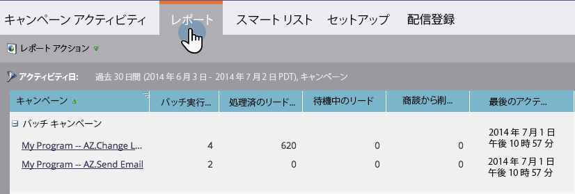

# キャンペーンアクティビティレポート {#campaign-activity-report}

[スマートキャンペーン](/help/marketo/product-docs/core-marketo-concepts/smart-campaigns/creating-a-smart-campaign/understanding-batch-and-trigger-smart-campaigns.md){target="_blank"}のパフォーマンスを確認します。

1. [レポートを作成](/help/marketo/product-docs/reporting/basic-reporting/creating-reports/create-a-report-in-a-program.md)し、**キャンペーンアクティビティ**[レポートタイプ](/help/marketo/product-docs/reporting/basic-reporting/report-types/report-type-overview.md){target="_blank"}を選択します。

1. [レポート時間枠を設定](/help/marketo/product-docs/reporting/basic-reporting/editing-reports/change-a-report-time-frame.md){target="_blank"}し、「**レポート**」タブをクリックします。

1. これで完了です。レポートを参照して、キャンペーンタイプ別にグループ化して最も効果的なキャンペーンを特定します。

>[!NOTE]
>
>すべての [ 実行可能なキャンペーン ](/help/marketo/product-docs/core-marketo-concepts/smart-campaigns/flow-actions/execute-campaign.md){target="_blank"} は、キャンペーンアクティビティレポートで「非アクティブなトリガーキャンペーン」として表示されます。

>[!TIP]
>
>最も多くのリードを処理したキャンペーンを検索するには、_処理された合計人数_&#x200B;で[レポートを並べ替え](/help/marketo/product-docs/reporting/basic-reporting/editing-reports/sort-report-on-columns.md){target="_blank"}、「**降順で並べ替え**」を選択します。

**[選択できる列 ](/help/marketo/product-docs/reporting/basic-reporting/editing-reports/select-report-columns.md) キャンペーン活動レポートの場合は、** の列が含まれます。

<table><thead>
  <tr>
    <th>列</th>
    <th>説明</th>
  </tr></thead>
<tbody>
  <tr>
    <td>バッチ実行カウント</td>
    <td>キャンペーンが実行された回数。</td>
  </tr>
  <tr>
    <td>処理済みのリード総数</td>
    <td>キャンペーンのフローを通過したリードの数。</td>
  </tr>
  <tr>
    <td>待機中のリード</td>
    <td>キャンペーンがまだ実行中の場合、「待機」ステップに残っているユーザーの数です。</td>
  </tr>
  <tr>
    <td>フローから削除済み</td>
    <td>キャンペーンから削除されたリードの数。</td>
  </tr>
  <tr>
    <td>最後のアクティビティ</td>
    <td>リードがキャンペーンで処理された最終日時。</td>
  </tr>
</tbody>
</table>

**レポートに表示されるキャンペーンタイプ**:

<table><thead>
  <tr>
    <th>タイプ</th>
    <th>説明</th>
  </tr></thead>
<tbody>
  <tr>
    <td>バッチ</td>
    <td>「マーケティングアクティビティ」タブのバッチキャンペーン。</td>
  </tr>
  <tr>
    <td>実行アクション</td>
    <td>人物アクションはデータベースから実行されます。</td>
  </tr>
  <tr>
    <td>トリガー起動 (アクティブ)</td>
    <td>「マーケティングアクティビティ」タブの現在のトリガーキャンペーン。</td>
  </tr>
  <tr>
    <td>トリガー起動 (非アクティブ)</td>
    <td>「マーケティングアクティビティ」タブの非アクティブなトリガーキャンペーン</td>
  </tr>
</tbody>
</table>

>[!MORELIKETHIS]
>
>[キャンペーンアクティビティレポートのフィルター](/help/marketo/product-docs/reporting/basic-reporting/report-activity/filter-a-campaign-activity-report.md){target="_blank"}
