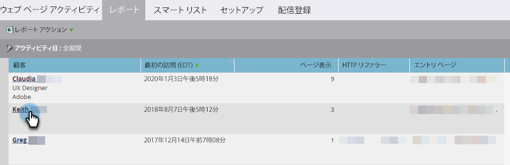
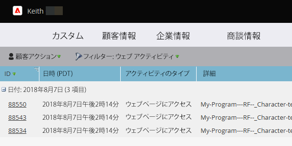

# 閲覧された web ページ、web ページアクティビティレポート {#web-pages-viewed-web-page-activity-report}

[[!UICONTROL Web ページアクティビティ]レポート](/help/marketo/product-docs/reporting/basic-reporting/report-types/web-page-activity-report.md)から、レポート内のユーザが閲覧した特定のページを確認できます。

>[!PREREQUISITES]
>
>Marketo で web サイトからアクティビティを取り込むには、まず[サイトに  [!DNL Munchkin]  を設定](/help/marketo/product-docs/administration/additional-integrations/add-munchkin-tracking-code-to-your-website.md)する必要があります。

1. [Web ページアクティビティレポート](/help/marketo/product-docs/reporting/basic-reporting/report-types/web-page-activity-report.md)で、ユーザの名前をクリックします。

   

1. 新しいタブが開き、そのユーザが訪問したサイトのページのリストと日時が表示されます。

   

   >[!MORELIKETHIS]
   >
   >[企業の web アクティビティレポート](/help/marketo/product-docs/reporting/basic-reporting/report-types/company-web-activity-report.md)を作成して、サイトを訪問している会社を確認します。
