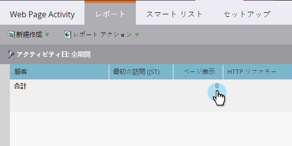

# 表示されたWebページ、Webページアクティビティレポート {#web-pages-viewed-web-page-activity-report}

ウェブページの [アクティビティレポートから](../../../../../product-docs/reporting/basic-reporting/report-types/web-page-activity-report.md)、レポート内の訪問者が閲覧した特定のページを表示できます。

>[!PREREQUISITES]
>
>MarketoのWebサイトからアクティビティを取り込むには、まずサイトにMunchkinを [設定する必要があります](../../../../../product-docs/administration/additional-integrations/add-munchkin-tracking-code-to-your-website.md)。

1. ウェブページ [アクティビティレポートで](../../../../../product-docs/reporting/basic-reporting/report-types/web-page-activity-report.md)、[ページ表示]列の数字をクリックします。

   

1. そこだ！ 新しいウィンドウが開き、その訪問者がサイトで訪問したページのリストと時間が表示されます。

   

   >[!NOTE]
   >
   >**関連記事**
   >
   >
   >会社 [ウェブアクティビティレポートを作成して](../../../../../product-docs/reporting/basic-reporting/report-types/company-web-activity-report.md) 、サイトの訪問者を調べます。

   >[!NOTE]
   >
   >**ディープダイブ**
   >
   >
   >レポートをさらに活用 詳しくは、 [基本レポート](http://docs.marketo.com/display/docs/basic+reporting) （英語）を参照してください。

