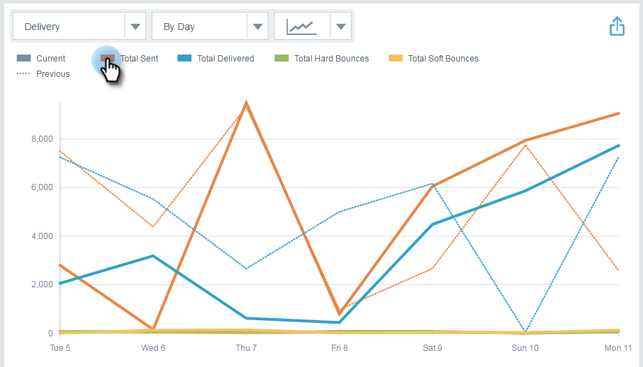

# 電子メールインサイト分析の概要 {#email-insights-analytics-overview}

Analyticsで、電子メールの配信とエンゲージメントのための集計データを調べます。 左側のグラフを使用してデータを調べ、右側のインサイトを使用してガイド付きのエクスペリエンスを得ます。

[フィルタリング](filtering-in-email-insights.md) （フィルタリング）は、特定の指標を掘り下げるのに役立ちます。

KPI （目標地点）タイルでは、より人気の高い指標をすばやく確認できます。

KPIタイルの上にカーソルを置くと、詳細が表示されます。

`   
`

...または、ブラウザーウィンドウを（大きい画面で）展開して、カーソルを合わせなくても詳細を表示できます。

` 

`

>[!TIP]
>
>その色は何かを意味する！ 緑は良い変化を示し、赤は悪い変化を示し、灰色は何も変わっていないことを示します。 これは、フィルタリングで選択した比較期間に基づきます。

グラフに、フィルターされた条件が表示されます。 フィルターの1つを非表示にするには、そのカラーバーをクリックします。

`   
`

...指標がグラフから消えます。 カラーバーを再度クリックして、再表示します。

`   
`

再び使用するグラフを作成する場合は、 [クイックグラフにします](email-insights-quick-charts.md)。

`   
`

ページの右側にあるガイド付き指標は、関連する要因を見つけるのに役立ちます。 任意の指標をクリックすると、その指標がページの左側のグラフに表示されます。

>[!NOTE]
>
>右上の「更新」を参照してください。 表示されたら、手動でクリックしてインサイトモジュールを更新する必要があります。 現在の値を無効にするフィルターを変更した場合にのみ表示します。

`  
You can also specify what you see (left to right): All, Audience, Content, and Platform.  
`  `   
`

>[!MORELIKETHIS]
>
>[電子メールインサイトから概要が送信される](email-insights-sends-overview.md)

