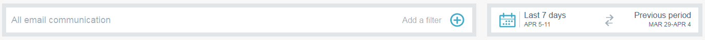

# メールインサイトの分析の概要 {#email-insights-analytics-overview}

分析では、メール配信およびエンゲージメントのための集計データを調べます。左側のグラフを使用してデータを調べ、右側のインサイトを使用してよりガイド付きのエクスペリエンスを得ます。

[フィルター](/help/marketo/product-docs/reporting/email-insights/filtering-in-email-insights.md)は、特定の指標に関する詳細な情報を参照するのに役立ちます。

主要目標地点（KPI）タイルでは、より人気の高い指標をすばやく確認できます。

KPI タイルにマウスポインタを合わせると、詳細が表示されます。

または、（大きい画面で）ブラウザーウィンドウを展開すると、マウスポインタを合わせずに詳細を表示できます。

>[!TIP]
>
>色には意味があります。緑は望ましい変化を示し、赤は望ましくない変化を示します。グレーは変化がないことを示します。これは、フィルタリングで選択した比較期間に基づきます。

グラフに、フィルターされた条件が表示されます。フィルターを非表示にするには、そのカラーバーをクリックします。

指標がグラフに表示されなくなります。カラーバーを再度クリックすると、再度表示されます。

再度使用するグラフを作成する場合は、[クイックチャート](/help/marketo/product-docs/reporting/email-insights/email-insights-quick-charts.md)にします。

ページの右側にあるガイド付き指標を使用すると、関連するドライバーを見つけることができます。任意の指標をクリックすると、ページの左側のグラフに表示されます。

>[!NOTE]
>
>右上の「更新」が表示されます。表示されたら、手動でクリックしてインサイトモジュールを更新する必要があります。「更新」は、現在の値を無効にするフィルターに変更を加えた場合にのみ表示されます。

また、表示する内容を指定することもできます。左から右に、「すべて」、「オーディエンス」、「コンテンツ」、「プラットフォーム」です。

>[!MORELIKETHIS]
>
>[メールインサイトの送信の概要](/help/marketo/product-docs/reporting/email-insights/email-insights-sends-overview.md)
