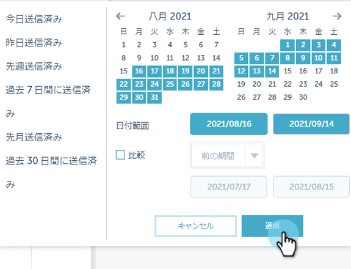
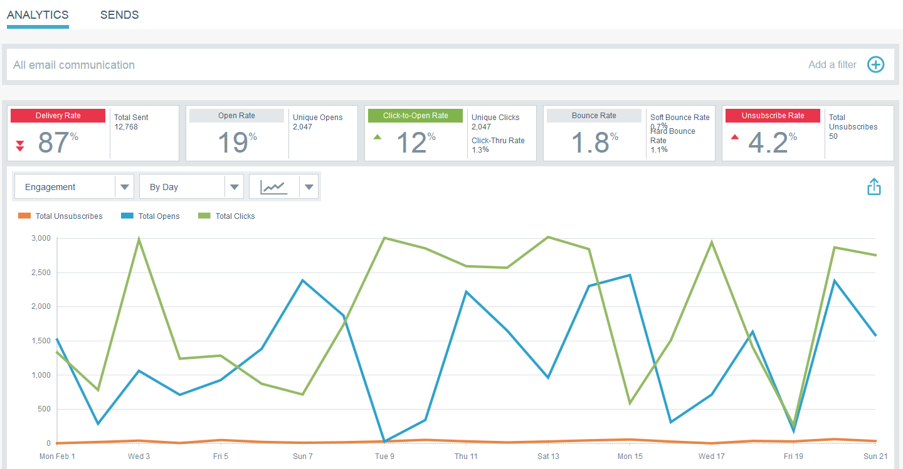
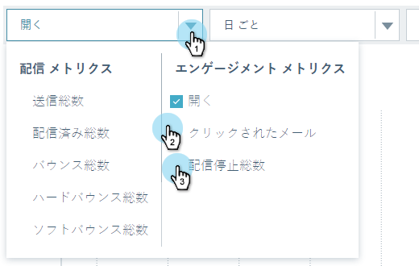

# 電子メールインサイトクイックグラフ {#email-insights-quick-charts}

クイックグラフは、カスタマイズして保存するサムネールで、最もよく使用するグラフの表示をすばやく確認できます。

## 新しいクイックグラフの作成 {#create-a-new-quick-chart}

この例では、2016年2月の最初の3週間のオープン率を、カリフォルニア州とフロリダ州で選択します。

1. Analytics画面の右側で日付フィルターをクリックします。

   

1. 目的の日付範囲を選択します。

   

1. 日付範囲を選択したら、「 **適用**」をクリックします。

   

1. 日付を適用すると、グラフが変更されます。

   

1. 最初のドロップダウンをクリックします。 をクリックして条件を選択し（まだ選択されていない場合）、不要な条件を選択解除します。

   

1. グラフの右側で、エクスポートアイコンをクリックし、「クイックグラフとして **保存**」を選択します。

   

1. クイックグラフに名前を付け、「 **保存**」をクリックします。

   

   >[!NOTE]
   >
   >クイックグラフは20個まで設定できます。 削除して置き換えることができます。

1. 新しいクイックグラフが他のユーザーと共に表示されます。

   

   それだ！

   >[!TIP]
   >
   >クイックグラフを移動するには、クリックして目的の位置にドラッグします。

## クイックグラフの削除 {#delete-a-quick-chart}

クイックグラフを削除しますか？ 簡単だ！

1. [ **クイックグラフ** ]アイコンをクリックします。

   

1. 目的のグラフの上にマウスポインターを置きますが、クリックしないでください。 カーソルを合わせると、Xが表示されます。 「 **X**」をクリックします。

   

1. 「 **OK**」をクリックします。

   

   クイックグラフが削除されました。 簡単だと言った。

